Reading ExoEOS through plots
============================

Changing one input at a time makes the state contracts easier to understand.
The plots below show representative pressure, temperature and composition
sweeps for every capability family in :doc:`overview`. They evaluate the
implemented models; the captions distinguish published tables, reference
observations and deliberately synthetic controls. Axes use mole fractions,
atomic fractions or mass fractions as explicitly labelled.

.. list-table:: What can be plotted?
   :header-rows: 1
   :widths: 24 44 32

   * - Capability
     - Plot and question
     - Interpretation
   * - Residual fluids
     - PR pressure--volume and ZD composition plots below; virial Z and fugacity.
     - Homogeneous model/root response, not a phase diagram.
   * - Caloric ideal gas
     - Enthalpy versus temperature; entropy versus composition.
     - Declared constant component heat capacities and references.
   * - Excess and full solutions
     - Ma activities, H dilution and decomposition of full Gibbs energy.
     - Atomic basis and supplied standards; no equilibrium selection.
   * - Mass-based solute
     - Solute potential and reciprocal host correction versus mass ppm.
     - Synthetic input illustrates the extensive scalar contract.
   * - Density providers
     - Mole-to-mass conversion and additive-volume composition curve.
     - A density adapter or mixing rule does not fit excess volume.
   * - Published tables
     - H/He density/entropy and silicate--H density/heat capacity.
     - Verified source files, including explicit missing cells.
   * - Alloy bounds
     - Local curvature and a whole-box lower bound as the domain expands.
     - Mathematical domain evidence, not empirical uncertainty.
   * - MELTS tools
     - Liquid water dilution and a fixed olivine site path.
     - Published mixing expressions; native standards and phase selection
       need separate calculations.
   * - M2 material tools
     - Major-gas alternatives and two observation-based reference examples.
     - Named conditions and concentration bases remain attached to the data.

The loader, species metadata and protocol objects support these calculations
rather than define additional physical curves. One representative path is
shown for the MELTS solution catalog and each reference family; this is not
a sweep of all 20 site models or a new coupled M2 calculation.

Residual fluids: existing PR and Zhang--Duan examples
-----------------------------------------------------

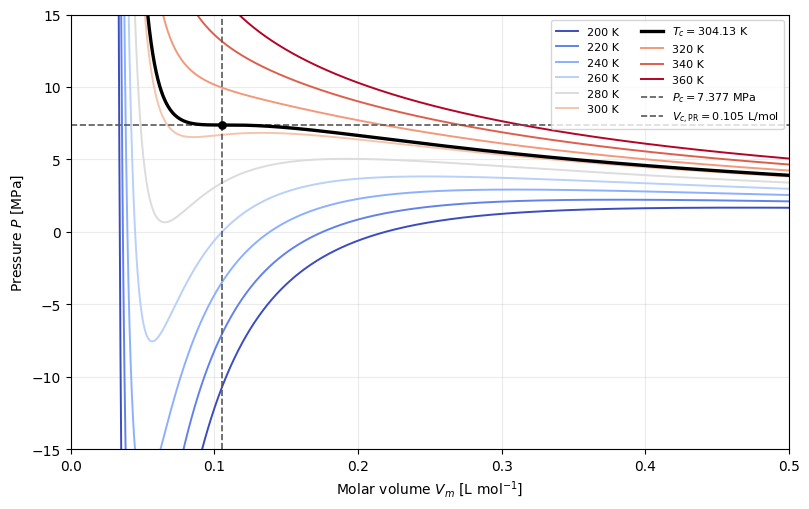

   The existing CO2 isotherms show how the PR pressure--volume curve changes
   around the critical temperature. See :doc:`tutorials/peng_robinson_eos`
   for the parameters and root interpretation.

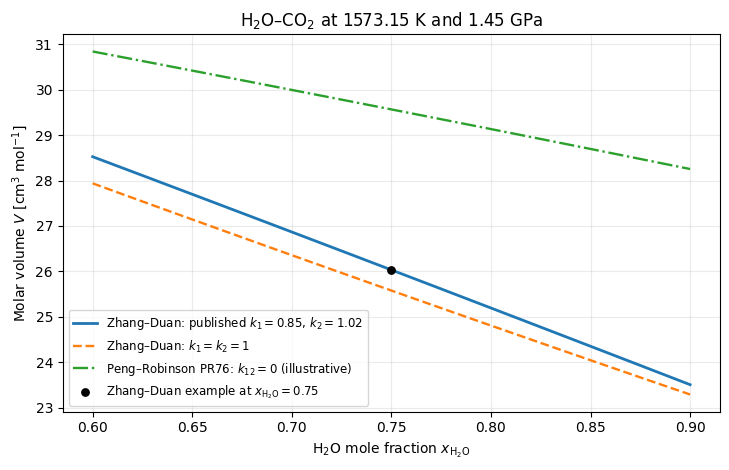

   The existing ZD plot varies H2O--CO2 composition at 1573.15 K and 1.45 GPa.
   It shows molar volume for the published binary parameters, a neutral
   interaction control and an illustrative PR comparison at the same T/P.
   See :doc:`tutorials/zhang_duan_eos`.

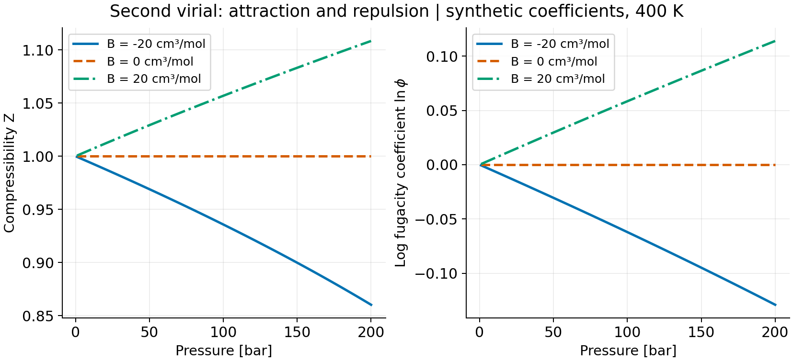

   At 400 K, synthetic B = -20, 0 and +20 cm3/mol isolate the coefficient's
   effect. The zero curve is evaluated with ``IdealEOS``; the other curves
   use ``SecondVirialEOS`` and ``state_tp``. The chosen 1--200 bar interval
   has a strictly stable inversion root. Numerical admissibility of these
   illustrative coefficients does not establish a measured gas calibration
   or bound omitted higher virials.

Caloric ideal gas
-----------------

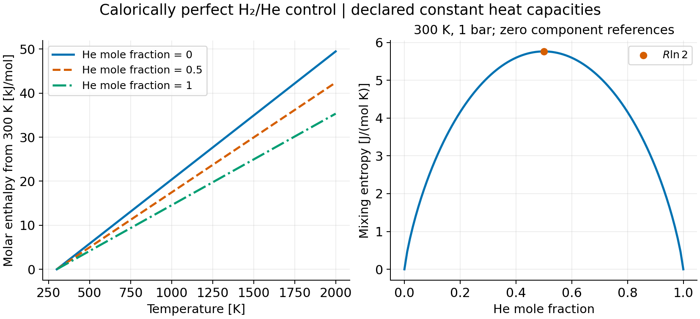

   ``IdealGas.state`` uses H2/He molar masses and declared cp/R = 3.5/2.5.
   The component reference h and s are zero at 300 K and 1 bar. Enthalpy is
   linear in temperature; at the reference T/P, entropy is entirely the
   mixing contribution and peaks at R ln 2. These constant heat capacities
   are a calorically perfect control across the illustrated interval.

Ma activities and the H dilution control
----------------------------------------

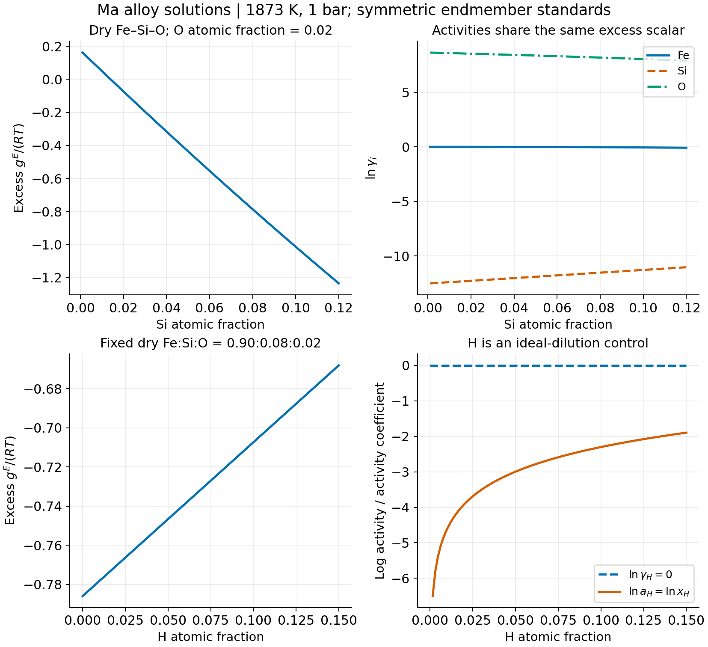

   The upper panels use ``MaFeSiOLiquid`` at 1873 K with O atomic fraction
   0.02 and Fe as the remainder. Both excess Gibbs and log activity
   coefficients come from ``solution_state`` under symmetric endmember
   standards. The lower panels preserve dry Fe:Si:O = 0.90:0.08:0.02 while
   adding H through ``MaFeSiOHLiquid``. Its H excess coefficient is exactly
   zero even though log H activity changes with concentration. This is the
   implemented no-H-interaction control, not a fitted H partition law.

See :doc:`fe_si_o_reference` and :doc:`fe_si_o_h_reference` for the conversion
from source activity standards; different standards change plotted
coefficients and must be carried with their chemical potentials.

Full solution Gibbs
-------------------

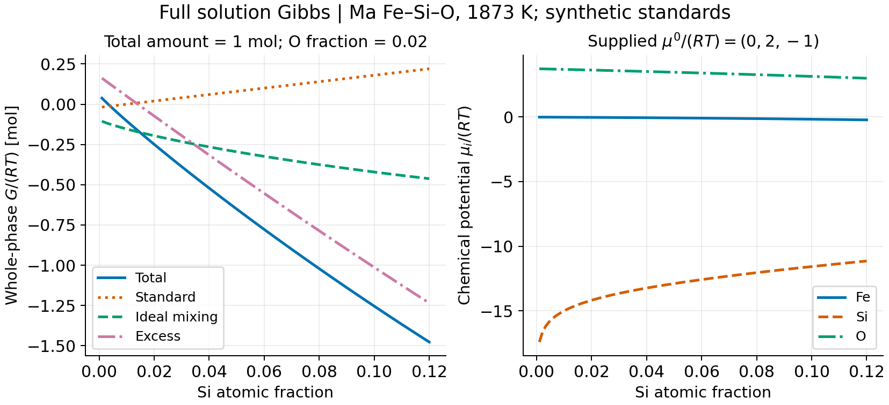

   ``total_solution_state`` adds standards, ideal mixing and the Ma excess
   term once. This example fixes the total amount at 1 mol, O fraction at
   0.02 and uses synthetic mu0/(RT) = (0, 2, -1) in Fe/Si/O order.
   The left axis is whole-phase G/(RT) in mol; the right is dimensionless
   mu/(RT). The ideal contribution is evaluated with ``IdealSolution``.
   These arbitrary standards illustrate the API, not an absolute alloy
   calibration. The generator checks G = sum(n_i mu_i).

Mass-fraction solute and its host
---------------------------------

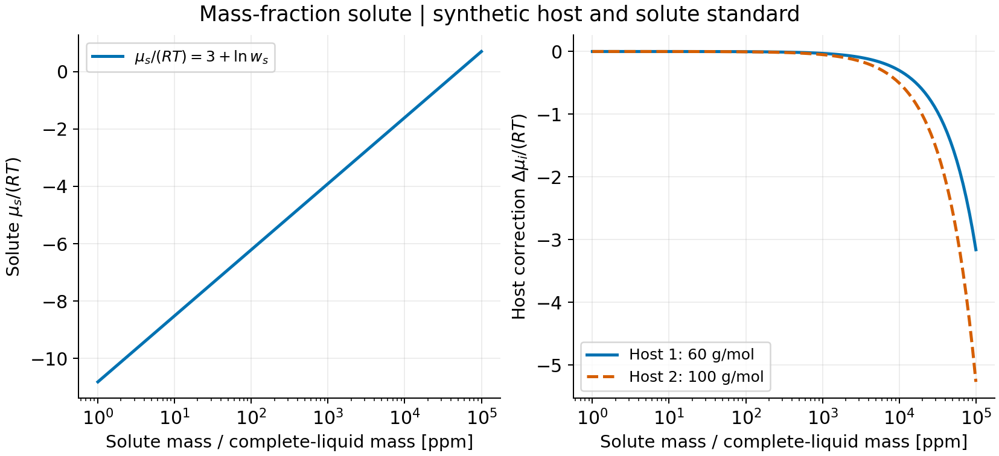

   An already mixed ideal host contains (0.8, 0.2) mol with molar masses
   (60, 100) g/mol. A synthetic 2 g/mol solute has mu0/(RT) = 3.
   ``mass_fraction_solute_state`` uses solute mass divided by complete
   liquid mass: the horizontal coordinate is 10^6 w_s, not dry-host ppm.
   The host correction grows as (W_i/W_s) ln(1-w_s). Suppressing that
   response would break the common extensive energy. No measured
   solubility coefficient is fitted here.

Mass density and additive volume
--------------------------------

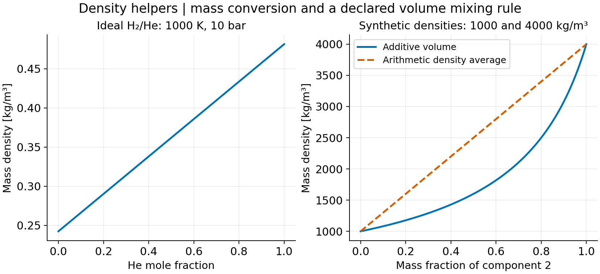

   At fixed 1000 K and 10 bar the ideal molar density is constant; the
   H2/He mass density changes because its mean molar mass changes.
   ``TPHelmholtzDensityProvider`` performs this conversion. The right
   panel isolates ``additive_volume_mass_density`` with synthetic component
   densities of 1000 and 4000 kg/m3. It sums specific volumes, so it differs
   from an arithmetic density average. The composite provider applies
   the same rule after resolving its explicit species groups.

H/He table: compression and caloric state
-----------------------------------------

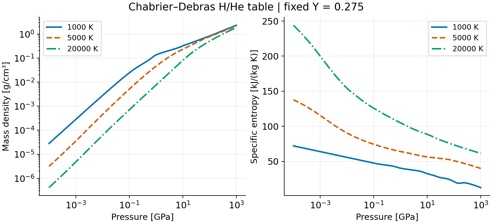

   ``ChabrierDebrasTableLoader`` verifies the published files before
   ``state_tp`` is evaluated. These curves use the fixed Y0275 variant,
   T = 1000, 5000 and 20000 K, and P = 10^5--10^12 Pa. Both density and
   entropy are mass-specific. Finite interpolation within the nominal
   table grid is not a physical-validity mask; no phase boundary is
   inferred from changes in slope. The generator also checks that the
   fixed-composition density adapter agrees with this table.

Silicate--H table: composition and missing cells
------------------------------------------------

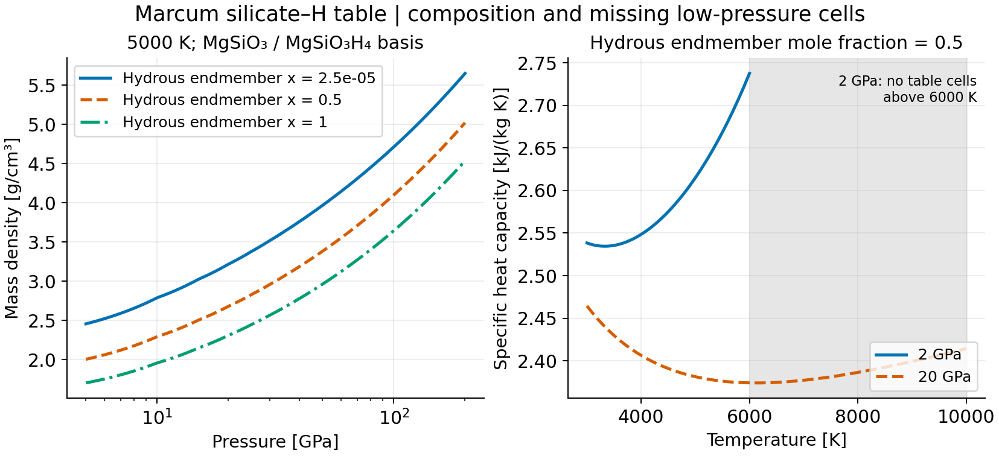

   ``MarcumSilicateHydrogenTableLoader`` verifies the pinned source CSV.
   Density at 5000 K varies with pressure and the MgSiO3H4 endmember mole
   fraction. The low-H endpoint is the table's 2.5e-5, not an invented
   zero-H row. At hydrous fraction 0.5 the 2 GPa heat-capacity curve stops
   above 6000 K, while the 20 GPa curve continues. Shading marks missing
   **2 GPa table cells**, not a physical transition or a missing 20 GPa
   state. The missing states remain NaN rather than being extrapolated.

Alloy bounds versus pointwise curvature
---------------------------------------

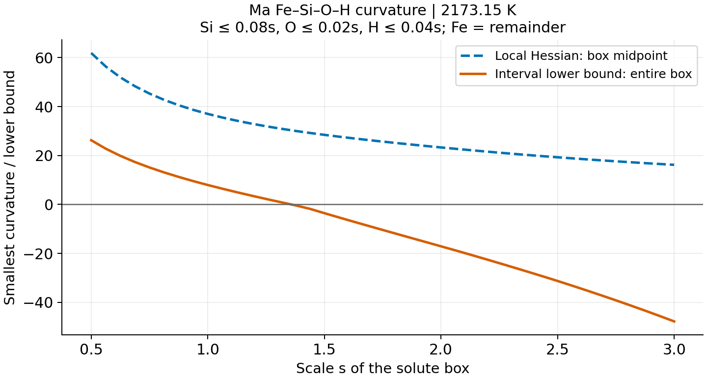

   The independent solute coordinates obey Si <= 0.08s, O <= 0.02s,
   H <= 0.04s and Fe = 1-Si-O-H at 2173.15 K. ``ma_interval`` supplies
   the entire-box lower bound; JAX evaluates a Hessian at each midpoint.
   A positive lower bound establishes curvature for the declared model
   throughout that box. A negative bound is inconclusive, even if a
   sampled point is convex. These are not empirical uncertainty bounds.

MELTS mixing expressions
------------------------

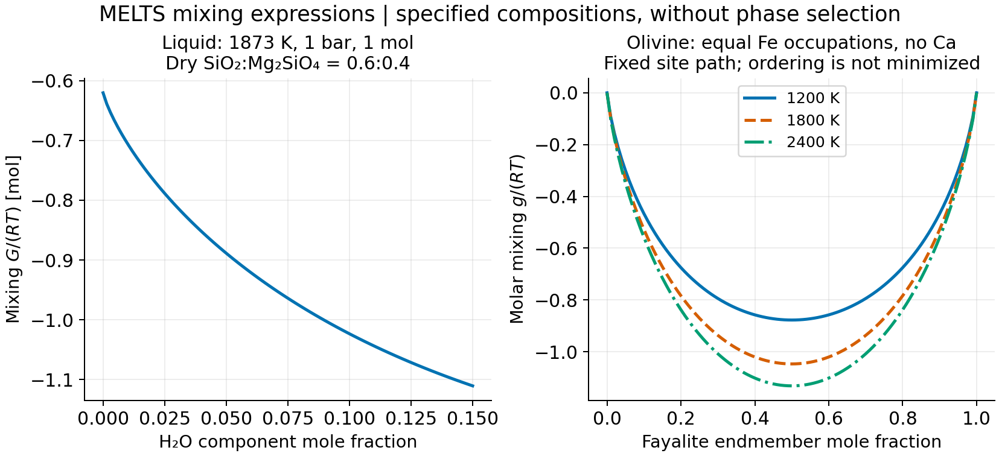

   Checkout tools ``melts_liquid_mixing.py`` and ``melts_solid_mixing.py``
   evaluate these source expressions without an external runtime. The
   liquid uses a synthetic dry SiO2:Mg2SiO4 = 0.6:0.4 component mixture
   at 1873 K and 1 bar, with a fixed 1 mol total. The olivine path fixes
   both Fe site occupations to the same x and sets Ca to zero. It neither
   minimizes ordering nor selects phases. Mixing terms alone do not
   compare absolute liquid and mineral stability. Native full G, density
   and caloric sweeps require native evaluations and compatible standards;
   these curves are not substituted for them.

M2 major-gas alternatives
-------------------------

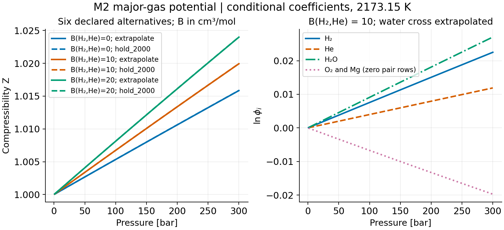

   The full declared five-species example has x(H2, He1, H2O1, O2, Mg1)
   = (0.75, 0.17, 0.06, 0.012, 0.008) at 2173.15 K. Six alternatives
   combine B(H2,He) = 0/10/20 cm3/mol with the two recorded water-cross
   policies. Solid and dashed curves nearly coincide at this scale.
   The right panel fixes B(H2,He) = 10 and ``extrapolate``: even the O2
   and Mg zero-pair rows retain ln(phi) = -ln Z. The alternatives do not
   form an empirical error band. This figure uses the checkout
   ``examples/m2_material/major_gas_eos.py`` provider, not a coupled solve.

Material observations and reference regressions
-----------------------------------------------

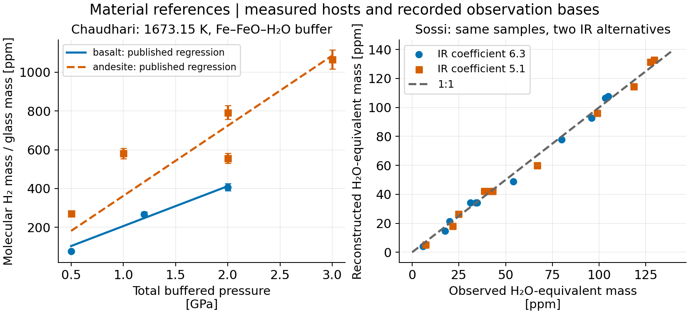

   Left: the stored Chaudhari data and the existing source-restricted
   regression API at 1673.15 K under the Fe--FeO--H2O buffer. Each curve
   spans only that host's measured pressure interval. Bars are reported
   observation standard deviations; the curves are the published fits,
   not new fits to these plotted points. Right: the existing Sossi
   reconstruction on 11 selected samples after the Per-5 background
   subtraction, excluding Per-1, Per-2 and Per-5 from the fit. The two
   infrared conversions apply to the **same observations**. This is an
   in-sample comparison, not independent validation. Its H2O-equivalent
   ppm is different from the molecular-H2 ppm on the left.

The figure reuses ``hydrogen_reference.py`` and
``sossi_water_calibration.py`` with their tracked source records. See
:doc:`m2_reaction_calibration` and :doc:`m2_material_contract` for the other
material references, host restrictions and provenance.

Reproduce the new figures
-------------------------

From a checkout with the docs extra installed::

   python -m pip install -e ".[docs]"
   python examples/plot_capabilities.py --table-cache /tmp/exoeos-plot-tables
   ./update_doc.sh -n -W --keep-going

The first plotting run needs access to the published table servers. The
normal Sphinx and Japanese LaTeX builds use committed images and do not
download tables or run scientific calculations. The existing PR/ZD images
remain generated by their respective notebooks.

The :download:`plot generator <../examples/plot_capabilities.py>` saves
12 PNGs and a :download:`provenance manifest <_static/feature_plots/manifest.json>`
with source hashes, table checksums, inputs, versions and numerical checks.
It checks pressure inversion, Gibbs Euler identities, analytic controls,
table masks and reference residuals before completing. PNG byte identity
can depend on the Matplotlib/font environment; the source and inputs are
recorded separately. Japanese captions accompany the identical PNG files
in ``doc_ExoEOS`` to keep the two editions' numerical figures aligned.
