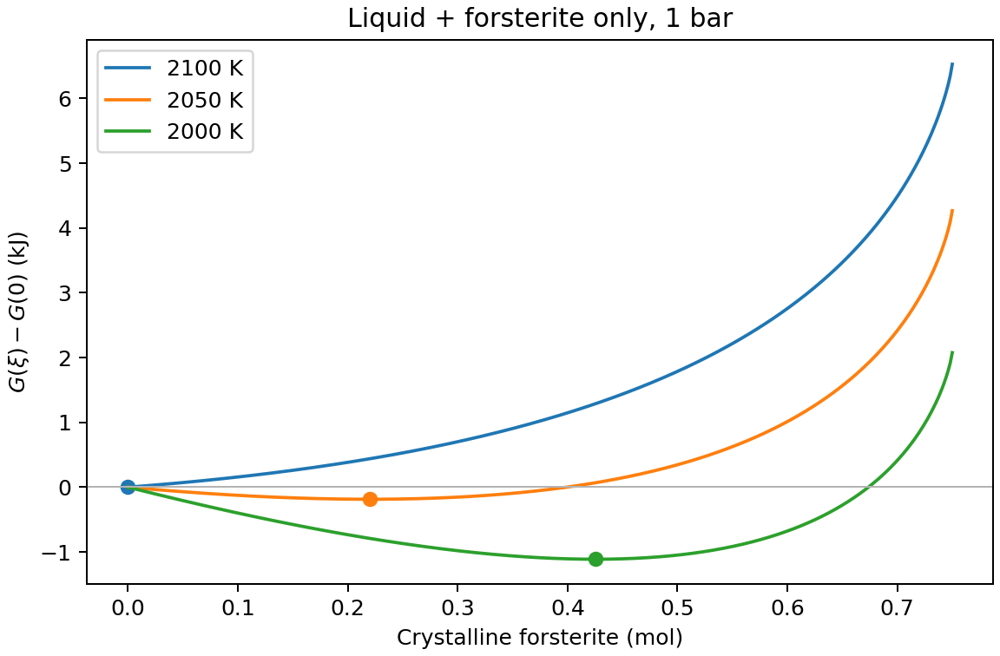
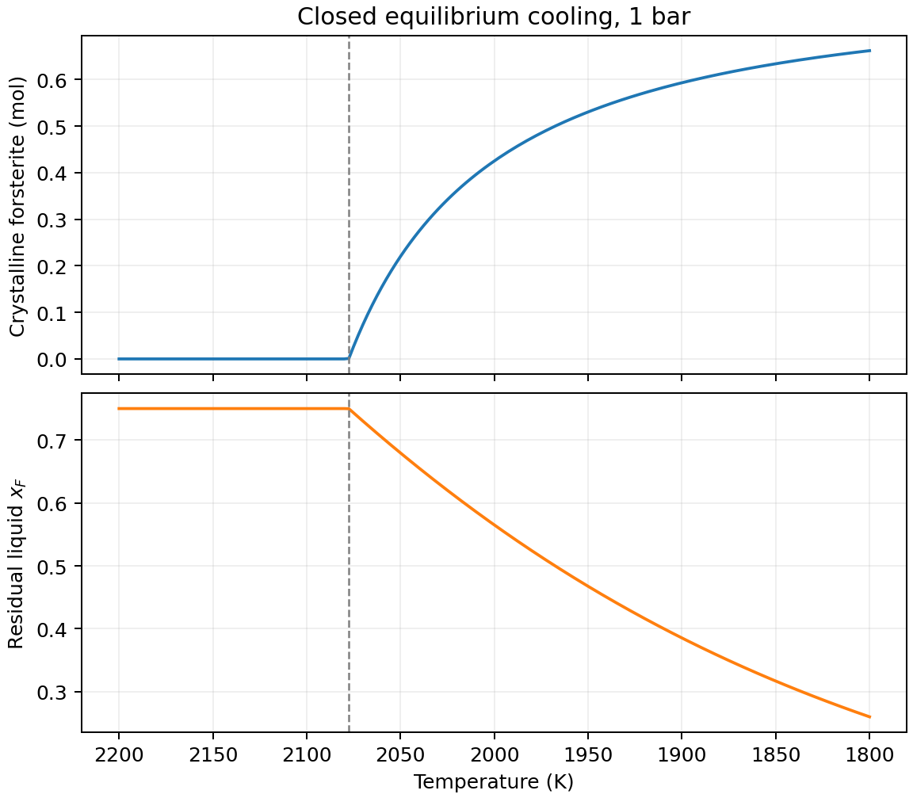
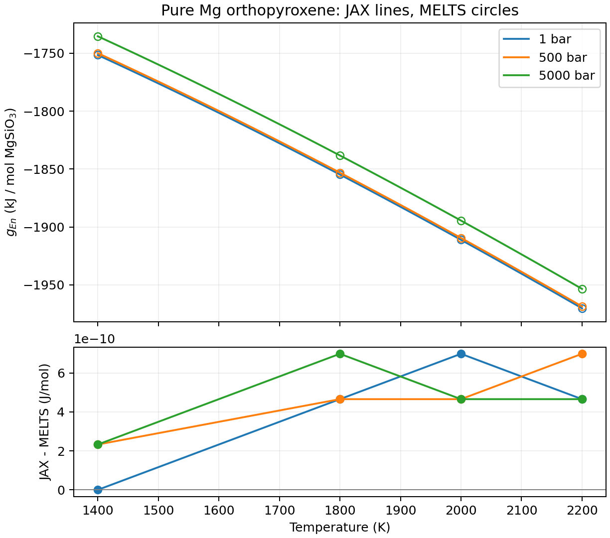
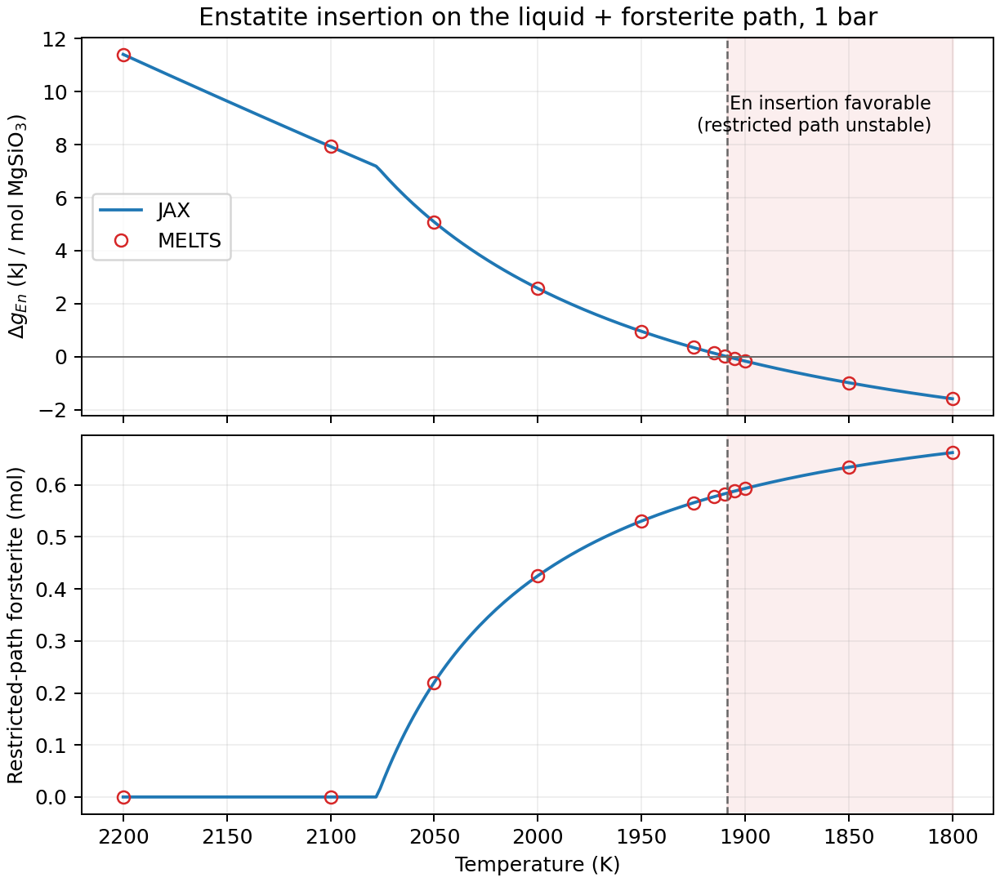
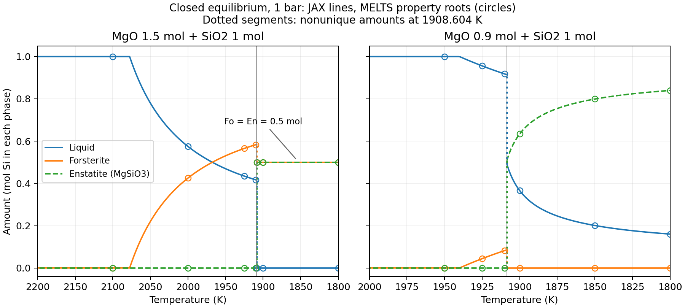
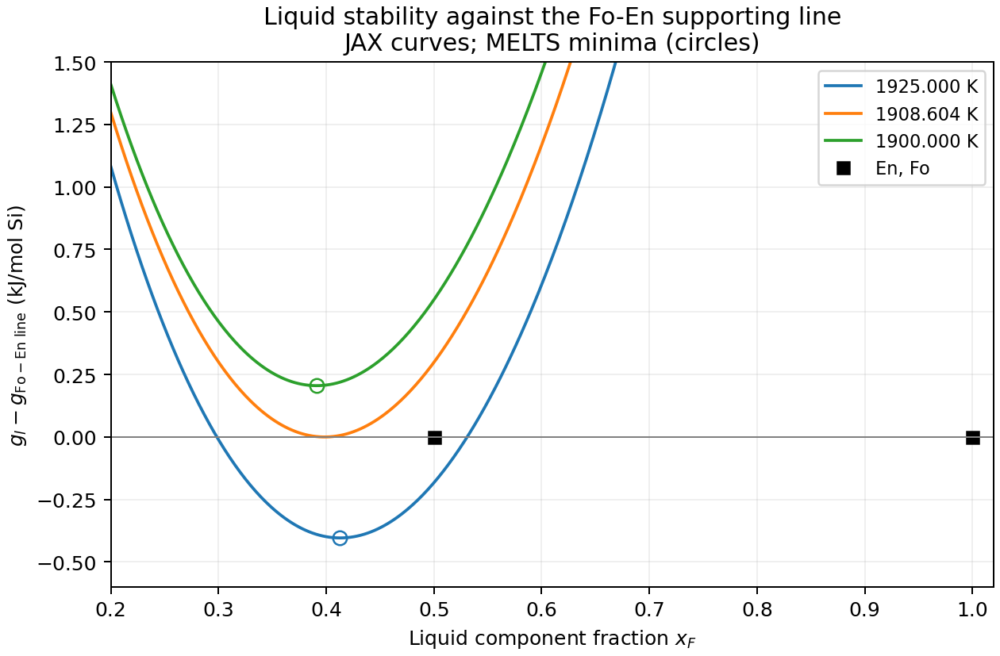

Native JAX magma: MgO--SiO2
===========================

``exoeos.magma`` evaluates a two-component MELTS liquid, pure crystalline
forsterite and the pure Mg orthopyroxene endpoint entirely in JAX,
including their standard Gibbs energies. The examples progress from
forsterite cooling and enstatite insertion to equilibrium phase amounts
after enstatite appears.
No external MELTS runtime is needed for evaluation, derivatives, the cooling
examples, or ordinary tests. Equilibrium is restricted to one liquid,
forsterite and Mg orthopyroxene; this is not the full MgO--SiO2 phase diagram.

Gibbs energy and component basis
--------------------------------

Let :math:`Q=\mathrm{SiO_2}` and :math:`F=\mathrm{Mg_2SiO_4}` be liquid
endmembers. They are composition coordinates, not a statement that the
liquid contains only those molecules. The model is

.. math::

   G_l=n_Q g_Q^0+n_F g_F^0
       +R_bT(n_Q\ln x_Q+n_F\ln x_F)
       +W\frac{n_Q n_F}{n_Q+n_F},\qquad x_i=\frac{n_i}{n_Q+n_F}.

The MELTS constants are :math:`R_b=8.3143` J/(mol K) and
:math:`W=3421` J/mol. Using oxide mole fractions in the entropy term would
define a different model.

The four functions have scalar ``T`` in K and ``P`` in Pa:

.. list-table:: API in ``exoeos.magma``
   :header-rows: 1
   :widths: 43 57

   * - Function
     - Result
   * - ``liquid_standard_gibbs(T, P)``
     - J/mol, shape (2,), ordered **SiO2, Mg2SiO4**.
   * - ``liquid_gibbs(T, P, n)``
     - Extensive G in J; ``n`` is shape (2,) in mol, in that same order.
   * - ``forsterite_gibbs(T, P)``
     - Crystalline Mg2SiO4 standard G in J/mol.
   * - ``enstatite_gibbs(T, P)``
     - Pure Mg orthopyroxene G in J per mol **MgSiO3**.

Use positive finite T/P and finite nonnegative amounts; validate material
inputs before entering JAX transformations. Static shapes are checked by
the functions. Enable x64 before calculations. Zero component amounts use
the continuous energy limit and an absent phase has exactly zero G.
Composition derivatives apply to positive interiors. The absent component's
ideal potential tends to minus infinity; an absent phase has no composition
or chemical potentials. Boundary energy evaluation is not a boundary
chemical-potential API.

.. code-block:: python

   import jax
   jax.config.update("jax_enable_x64", True)
   import jax.numpy as jnp
   from exoeos.magma import liquid_gibbs

   T, P = 2000.0, 1.0e5
   n = jnp.array([0.25, 0.75])
   G = jax.jit(liquid_gibbs)(T, P, n)             # J
   mu = jax.grad(liquid_gibbs, 2)(T, P, n)       # J/mol
   entropy = -jax.grad(liquid_gibbs, 0)(T, P, n) # J/K
   volume = jax.grad(liquid_gibbs, 1)(T, P, n)   # m3
   values = jax.jit(jax.vmap(liquid_gibbs, in_axes=(0, None, None)))(
       jnp.array([2000.0, 2050.0, 2100.0]), P, n
   )

For existing reduced interfaces, divide the dimensional G by the caller's
common R*T. This conversion does not change :math:`R_b` inside the physical
mixing entropy. ``total_solution_gibbs_RT`` gives the same result with the
same standards, interaction and gas constant. Standards retain their T/P
dependence when taking thermal and pressure derivatives.

Standard states
---------------

The solid uses the Berman reference at 298.15 K and 1 bar:
:math:`H_r=-2174420` J/mol, :math:`S_r=94.010` J/(mol K), and

.. math::

   C_{p,s}(T)=238.64-2001.3/\sqrt{T}-1.1624\,10^8/T^3.

Integrate Cp and Cp/T for H and S, then use G=H-TS and the integrated
Berman pressure polynomial. Liquid F starts from the solid reference at
2163 K, adds fusion entropy 57.2 J/(mol K), and uses liquid Cp=271 J/(mol K).
Liquid Q follows the dedicated ``gibbs.c`` SiO2 formula, with a branch
change at 1480 K. G and its first temperature derivative are continuous;
the heat capacity can jump. The high-temperature branch is selected at
equality. The general tabulated SiO2 fusion formula is not used.

Both liquids use the integrated Kress pressure polynomial relative to
1 bar, with reference temperature 1673 K. Internal volumes are J/(bar mol),
so pressure is converted from Pa to bar before integration. Differentiating
the returned G with respect to Pa gives SI volume. Pressure checks are
formula checks, not high-pressure calibration.

Conservation and minimization
-----------------------------

An initial oxide inventory of M mol MgO and S mol SiO2 gives
:math:`a=M/2` mol F and :math:`b=S-M/2` mol Q. This nonnegative basis requires
:math:`0\le M/S\le2` with S>0. Crystallizing :math:`\xi` mol forsterite leaves
:math:`n_F=a-\xi` and :math:`n_Q=b`, conserving Mg, Si, O and mass. Crystals
remain in the closed system. Minimize

.. math::

   G_{\rm total}(\xi)=G_l(T,P,[b,a-\xi])+\xi g_{F,s}^0,
   \qquad 0\le\xi\le a.

Its derivative is

.. math::

   \frac{dG_{\rm total}}{d\xi}=g_{F,s}^0-\mu_{F,l},\qquad
   \mu_{F,l}=g_{F,l}^0+R_bT\ln x_F+W x_Q^2.

A nonnegative initial slope selects zero crystals. A negative initial
slope favors crystallization; an interior minimum satisfies equality of
the solid and liquid potentials. The example bisects the derivative of
this same G. It requires T>W/(2R_b), where the binary liquid is strictly
convex. The pure F case compares the two standards directly; at equality
any phase fraction minimizes G, and the example returns zero crystals.
General phase equilibrium and phase selection remain ExoGibbs responsibilities.

Cooling example
---------------

Run from the source checkout with the optional plotting dependency:

.. code-block:: bash

   JAX_ENABLE_X64=1 MPLBACKEND=Agg python examples/magma_cooling.py \
       --output documents/_static/magma

For M=1.5 mol, S=1 mol, P=1 bar, the restricted onset is **2077.600179 K**.

.. list-table:: Closed equilibrium cooling
   :header-rows: 1

   * - T (K)
     - Crystalline forsterite (mol)
     - Residual liquid x_F
   * - 2100
     - 0
     - 0.750000
   * - 2050
     - 0.220119
     - 0.679438
   * - 2000
     - 0.425209
     - 0.565059

   The energy minimum determines the crystalline amount; points mark the minima.

   Dashed lines mark the restricted onset. Cooling proceeds from left to right.

Enstatite and silica solids are omitted from this minimization. The next
section tests enstatite insertion without calculating its equilibrium amount.
Competing phase stability must be examined before interpreting this as the
physical binary phase diagram. MgO/SiO2>2 requires a different basis.

Enstatite insertion and comparison with MELTS
-----------------------------------------------

``enstatite_gibbs(T, P)`` returns the pure Mg **orthopyroxene** endpoint,
in J per mol MgSiO3. It is not a minimum over enstatite polymorphs or a
pyroxene solid-solution model. The MELTS endmember basis is Mg2Si2O6,
so one native mole corresponds to two API moles.

The tabulated Mg2Si2O6 standard is monoclinic, including for orthopyroxene.
The total orthopyroxene endpoint also needs its site energy minus the
monoclinic pure-reference energy. At the pure Mg end there is no ordering
freedom or configurational site entropy. Reducing the published expression
gives, per native mole, :math:`\Delta H=-5020.8` J/mol,
:math:`\Delta S=-2.3237936` J/(mol K), and
:math:`\Delta V=-0.0619232` J/(bar mol). With :math:`P_b=P/10^5`,

.. math::

   g_{\rm En}=\frac{1}{2}\left[g_{\rm CEn}^0(T,P)
        -5020.8+2.3237936T-0.0619232(P_b-1)\right].

The monoclinic standard follows the Berman Cp and pressure integrals in
``sol_struct_data.h``. The endpoint correction comes from
`orthopyroxene.c <https://github.com/magmasource/MAGMA/blob/705a0fb315e5054d18275a580562f6121c8e458c/sources/orthopyroxene.c>`_
at the same pinned revision. Comparing a raw endmember standard alone
would miss this correction.

   Pure Mg orthopyroxene at 1, 500 and 5000 bar. Lines are JAX; circles are
   actual pinned MELTS evaluations, converted from Mg2Si2O6 to MgSiO3.
   The maximum absolute difference across these 12 states is 7e-10 J/mol.
   Pressure comparisons check formulas, not empirical high-pressure accuracy.

One mol of MgSiO3 consumes half a mol each of liquid Q and F. For a
present liquid with both amounts positive, the insertion derivative is

.. math::

   \Delta g_{\rm En}=g_{\rm En}-\frac{\mu_{Q,l}+\mu_{F,l}}{2}
      =\left.\frac{\partial}{\partial\eta}
       \left[G_l(T,P,[n_Q-\eta/2,n_F-\eta/2])+\eta g_{\rm En}\right]
       \right|_{\eta=0}.

``examples/magma_cooling.py::enstatite_insertion_energy`` evaluates this
derivative using the same JAX liquid G. A negative value proves the supplied
state is unstable to this candidate. A nonnegative value checks only Mg
orthopyroxene and does not establish stability against every omitted phase.
Enstatite insertion conserves Mg, Si, O and mass.

On the existing 1 bar, 1.5 mol MgO + 1 mol SiO2 closed cooling path, the
derivative crosses zero at **1908.603653 K**, with 0.584374215 mol
forsterite. At 2000 K it is +2578.340908 J/mol; at 1900 K it is
-167.806610 J/mol. The continuation below the crossing remains a restricted
liquid + forsterite calculation and is unstable when orthopyroxene is allowed.
The following equilibrium example also allows enstatite and calculates
the phase amounts beyond this crossing.

   Cooling proceeds from left to right. Circles use a separate bisection
   of actual MELTS liquid chemical potentials against pure forsterite G.
   The upper panel tests enstatite insertion on each independently computed
   path; the lower panel compares the restricted forsterite amounts.
   The shaded continuation is unstable to enstatite insertion.

``tests/reference/enstatite_source_v1.json`` independently integrates Cp,
Cp/T and V and evaluates the previously transcribed site polynomials at
the exact Mg endpoint. It records G, S, Cp and V at 12 T/P states.
``tests/reference/enstatite_melts_v1.json`` separately records 12 actual
MELTS endpoint evaluations and 12 restricted cooling states. The latter
use fresh workers and 40 bisections of native chemical potentials, with
no JAX thermodynamic model or MELTS phase-assemblage solver. The maximum
JAX/backend differences are 2.2e-7 J/mol for insertion energies and
2.1e-11 mol for forsterite amounts. Tests allow 1e-6 J/mol and 1e-9 mol,
respectively. Source agreement and these finite backend comparisons do
not validate a complete experimental phase diagram.

Regenerate the figures and numerical summary without an external runtime:

.. code-block:: bash

   JAX_ENABLE_X64=1 MPLBACKEND=Agg python examples/magma_enstatite.py \
       --output documents/_static/magma

Regenerate either independent fixture:

.. code-block:: bash

   python tests/reference/generate_enstatite_reference.py \
       --output tests/reference/enstatite_source_v1.json
   python tests/reference/generate_enstatite_reference.py --runtime /path/to/pinned/runtime \
       --python /path/to/worker/python --output tests/reference/enstatite_melts_v1.json

Equilibrium after enstatite appears
-----------------------------------

``examples/magma_equilibrium.py`` minimizes the same G over liquid,
pure forsterite (Fo) and pure Mg orthopyroxene (En). With retained crystals,
:math:`\xi` mol Fo and :math:`\eta` mol MgSiO3 leave

.. math::

   n_Q=b-\eta/2,\qquad n_F=a-\xi-\eta/2,\qquad
   G_{\rm total}=G_l(T,P,[n_Q,n_F])+\xi g_{\rm Fo}+\eta g_{\rm En}.

All four amounts must be nonnegative. These constraints conserve Mg, Si,
O and mass, including when previously crystallized Fo is consumed.
The two crystallization derivatives are :math:`g_{\rm Fo}-\mu_F`
and :math:`g_{\rm En}-(\mu_Q+\mu_F)/2`.

For T>W/(2R_b), the liquid is strictly convex in composition. The small
example compares the liquid + Fo edge, the liquid + En edge, and the
all-solid state :math:`(\xi,\eta)=(a-b,2b)` when a>=b. Each liquid/solid
edge is a one-dimensional minimization; the pure-composition cases compare
energies directly. A three-phase stationary point has a flat direction
that reaches these edges, so an interior two-dimensional optimizer is
unnecessary. The all-liquid state is included explicitly. Absent liquid
contributes exactly zero G and is never assigned chemical potentials.
This eager, scalar example adds no solver dependency to ExoEOS; general
phase selection remains an ExoGibbs responsibility.

At fixed pressure a binary three-phase equilibrium is invariant, consistent
with the `phase rule <https://goldbook.iupac.org/terms/view/P04533>`_.
At **1908.603653 K**, the common liquid has :math:`x_F=0.398497376`.
Its Q:F ratio is preserved while liquid and Fo react into En. For the
original 1.5 mol MgO + 1 mol SiO2 inventory, the equilibrium endpoints are

.. math::

   [n_Q,n_F,\xi,\eta]
   =[0.25,0.165625785,0.584374215,0]
   \quad\hbox{and}\quad [0,0,0.5,0.5].

Every convex combination has the same G at the invariant. Temperature,
pressure and bulk inventory alone do not fix the amount along this segment;
an additional enthalpy or heat-removal condition would be needed. A prescribed
temperature path therefore has a jump, not an interval of three-phase
coexistence. Below the invariant the original inventory is all solid in
this phase set: **0.5 mol Fo + 0.5 mol MgSiO3**. Forsterite decreases during
the reaction instead of following the unstable Fo-only continuation.

``equilibrium(T, P=1e5, mgo_mol=1.5, sio2_mol=1.)`` returns
``amounts_mol`` in **[liquid Q, liquid F, solid Fo, solid En]** order,
``g_J``, ``degenerate``, and ``equilibrium_endpoints_mol``. It requires x64
and the same T/P/inventory domain as the Fo-only example. Distinct endpoints
whose energies differ by at most 1e-7 J per initial mol Si flag degeneracy;
``amounts_mol`` then selects the endpoint with least liquid as a convention,
and the full conserved segment is retained. The equilibrium selector itself
is not a JAX-transformable or differentiable phase solver.

.. list-table:: Equilibrated amounts at 1900 K and 1 bar
   :header-rows: 1

   * - Initial MgO / SiO2 (mol/mol)
     - Liquid [Q, F] (mol)
     - Fo (mol)
     - En (mol MgSiO3)
   * - 1.5 / 1
     - [0, 0]
     - 0.5
     - 0.5
   * - 0.9 / 1
     - [0.232967246, 0.132967246]
     - 0
     - 0.634065507

   JAX lines and independent restricted equilibria using MELTS properties
   (circles). Dotted vertical segments represent the nonunique invariant
   amounts. Each plotted amount is mol Si in that phase: liquid Q+F, mol Fo,
   or mol MgSiO3. The 0.9/1 inventory consumes all Fo at the invariant and
   continues as liquid + En. Omitted silica solids can affect that path.

An absent liquid also needs a stability test. With both solids present,
their supporting chemical potentials are
:math:`\lambda_Q=2g_{\rm En}-g_{\rm Fo}`, :math:`\lambda_F=g_{\rm Fo}`.
Minimize :math:`g_l(x)-[(1-x)\lambda_Q+x\lambda_F]` over liquid composition
:math:`x=x_F`. A positive minimum means liquid formation raises G.
This line extends below x=1/2 as a chemical-potential reference; a physical
Fo+En mixture itself only spans 1/2<=x<=1.

   The liquid minimum is negative at 1925 K, zero at the invariant and
   positive at 1900 K. Circles are minima found independently from actual
   MELTS chemical potentials. This verifies liquid disappearance for the
   Fo+En inventory without differentiating an absent phase.

``tests/reference/magma_equilibrium_melts_v1.json`` stores 13 equilibria
for the two inventories and a separately solved invariant. Its generator
uses pinned MELTS liquid G/mu and pure olivine/orthopyroxene properties,
supporting-line stability, and SciPy roots. It imports neither the JAX
thermodynamic model nor this example's equilibrium selector. The comparison
is to the **same restricted phase set using MELTS properties**, not the
full MELTS phase-assemblage solver or an experimental phase diagram.
The maximum amount difference is 9.9e-12 mol, total-G difference 1.5e-5 J,
and invariant-temperature difference 3.1e-11 K in this run. Ordinary tests
read the saved fixture and check conservation, coexistence, disappearance,
invariant segments, scaling, and energies against a feasible 2-D grid.

.. code-block:: bash

   JAX_ENABLE_X64=1 MPLBACKEND=Agg python examples/magma_equilibrium.py \
       --output documents/_static/magma
   # Reference regeneration only; requires the pinned runtime and SciPy:
   python tests/reference/generate_magma_equilibrium_reference.py \
       --runtime /path/to/pinned/runtime --python /path/to/worker/python \
       --output tests/reference/magma_equilibrium_melts_v1.json

Provenance and independent checks
---------------------------------

The port uses MAGMA revision ``705a0fb315e5054d18275a580562f6121c8e458c``:
`standard-state equations <https://github.com/magmasource/MAGMA/blob/705a0fb315e5054d18275a580562f6121c8e458c/sources/gibbs.c>`_,
`liquid coefficients <https://github.com/magmasource/MAGMA/blob/705a0fb315e5054d18275a580562f6121c8e458c/includes/liq_struct_data.h>`_,
`solid coefficients <https://github.com/magmasource/MAGMA/blob/705a0fb315e5054d18275a580562f6121c8e458c/includes/sol_struct_data.h>`_, and
`liquid interaction <https://github.com/magmasource/MAGMA/blob/705a0fb315e5054d18275a580562f6121c8e458c/includes/param_struct_data_v34.h>`_.

``tests/reference/magma_source_v1.json`` records independent numerical
integration of the published Cp, Cp/T and V, with source hashes.
It tests G, entropy, heat capacity and volume at 11 T/P states, including
both sides of 1480 K. This is source-formula validation, not a compiled
MAGMA run. Existing saved MELTS liquid standards are also checked.

``tests/reference/magma_melts_v1.json`` separately records 13 supplied
states from the hash-pinned alphaMELTS 2.3.2 / rhyolite-MELTS 1.0.2 runtime.
The maximum absolute standard-state differences are 4.7e-10 J/mol for the
liquids and 1.4e-9 J/mol for solid F. Maximum differences for mixed G and
interior chemical potentials are 1.7e-5 J and 2.4e-5 J/mol, respectively
(test tolerance 3e-5). Pure F liquid oxide conversion fails in the pinned
worker with negative SiO2; that unavailable case is retained explicitly.
The JAX endpoint is covered by the continuous energy and standard-state checks.

Regenerate either independent fixture without importing the JAX model:

.. code-block:: bash

   python tests/reference/generate_magma_reference.py \
       --output tests/reference/magma_source_v1.json
   python tests/reference/generate_magma_reference.py --runtime /path/to/pinned/runtime \
       --python /path/to/worker/python --output tests/reference/magma_melts_v1.json

Only the second command needs MELTS and its Python worker dependencies.
Ordinary tests read the saved JSON files. They also check composition
derivatives, extensivity, elemental/mass conservation, onset, coexistence,
energy boundaries, jit/vmap, and joint T/P/composition differentiation.
The public source revision's identity with the distributed thermodynamic C
build remains unestablished. Formula consistency, these finite binary
comparisons, and experimental phase-diagram validation are distinct claims.
