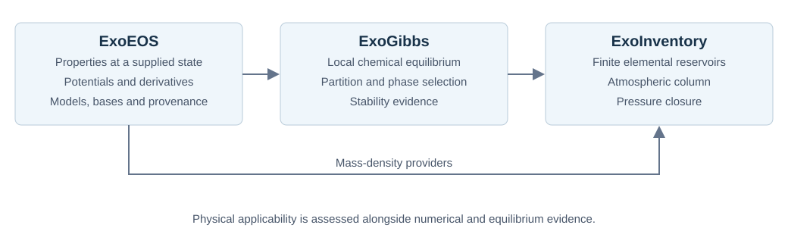
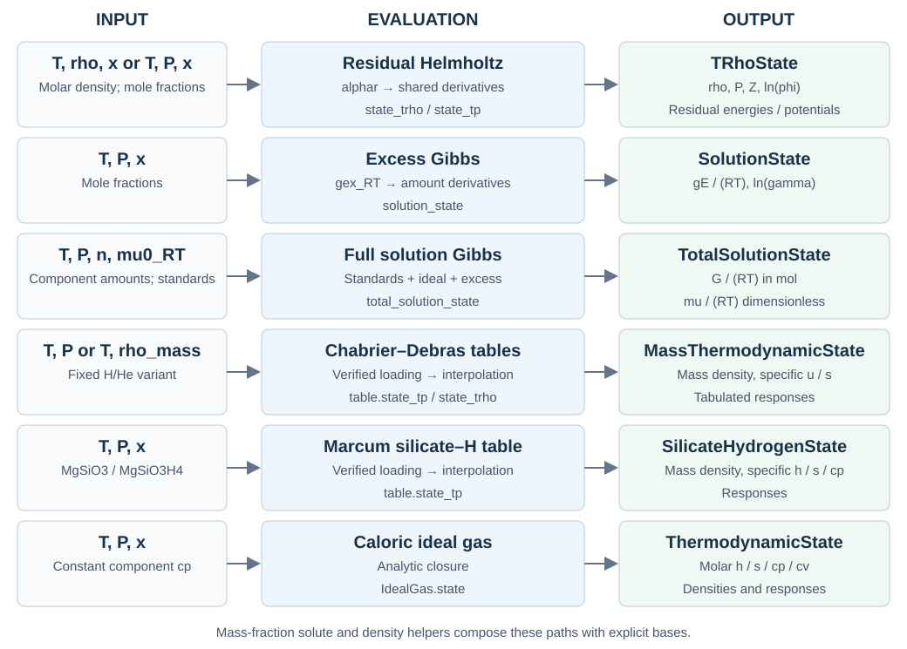

What ExoEOS provides
====================

ExoEOS evaluates thermodynamic properties at a supplied state and composition.
Its free-energy models provide a scalar potential and consistent derivatives;
its table models interpolate the quantities supplied by the published tables.
Use :doc:`model_guide` to choose an evaluation path and find a minimal example.
Use :doc:`feature_plots` to see how the outputs change with temperature,
pressure and composition.

The original capability survey used source commit
`f049cfc <https://github.com/HajimeKawahara/exoeos/tree/f049cfcb3f42e198124c8f6c921385ff0d67f69d>`_
(reviewed on 2026-10-08); this overview also covers the subsequent total
Helmholtz derivative engine and native binary magma model. A historical
calculation elsewhere in the documentation retains its own source revision,
inputs, and validation scope.
The `Japanese explanation <https://github.com/HajimeKawahara/doc_ExoEOS>`_
is maintained separately in ``doc_ExoEOS/main_ja.tex``. English API and usage
updates belong here; the older ``doc_ExoEOS/main_en.tex`` is a historical edition.

Responsibilities
----------------

   Property evaluation, local equilibrium, and planetary amount closure have
   separate responsibilities. A property evaluation alone does not solve the
   coupled problem.

.. list-table:: Inputs and results at each boundary
   :header-rows: 1
   :widths: 18 40 42

   * - Layer
     - Receives
     - Provides
   * - ExoEOS
     - Temperature, pressure or density, composition or amounts, and a
       declared model; standards where required.
     - Pressure, density, fugacity/activity coefficients, or full phase
       potentials and their conventions, depending on the evaluator.
   * - ExoGibbs
     - Phase properties, reaction/standard-state conventions, and elemental
       constraints.
     - Local chemical equilibrium, partition, phase selection, and the
       applicable stability evidence.
   * - ExoInventory
     - Local chemistry, density, absolute reservoirs, and column conditions.
     - Finite elemental budgets, atmospheric column amounts, and pressure
       closure.

Available capabilities
----------------------

Installation scope and physical applicability are different questions.
``exoeos`` exports the package APIs below. The separately identified
``examples/`` tools require a source checkout; they are not installed by the
package's ``src/`` build configuration.

.. list-table:: Capability map
   :header-rows: 1
   :widths: 22 43 35

   * - Capability
     - Implementation
     - Main boundary
   * - Residual fluid properties
     - ``IdealEOS``, ``SecondVirialEOS``, ``PengRobinsonEOS``,
       ``ZhangDuanEOS``; ``state_trho`` and ``state_tp``.
     - ``TRhoState`` gives density, pressure, Z and residual/composition
       quantities. It has no caloric fields such as enthalpy or heat capacity.
   * - Caloric ideal gas
     - ``IdealGas.state``: density, enthalpy, entropy, heat capacities and
       responses.
     - Component heat capacities are constant; reference enthalpies and
       entropies are supplied by the caller.
   * - Total Helmholtz thermodynamics
     - ``thermodynamic_state_trho`` and ``HelmholtzThermodynamics``:
       enthalpy, entropy, heat capacities, sound speed, compressibilities,
       expansion and adiabatic gradient from one free energy.
     - Requires a complete molar Helmholtz potential, including an ideal
       closure. Responses hold composition fixed in a homogeneous phase;
       see :doc:`thermodynamic_derivatives`.
   * - Published tables
     - ``ChabrierDebrasEOS`` for fixed H/He variants;
       ``MarcumSilicateHydrogenEOS`` for MgSiO3--MgSiO3H4.
     - Dedicated mass-specific states. Neither table path supplies
       fugacity coefficients or component chemical potentials.
       The H/He backend also offers a separate, opt-in
       :doc:`potential-consistent reconstruction <potential_tables>`.
   * - Excess solution properties
     - ``IdealSolution``, ``MaFeSiOLiquid``, ``MaFeSiOHLiquid``;
       ``solution_state`` gives excess Gibbs and log activity coefficients.
     - Symmetric mole-fraction/endmember standards. The H extension has
       zero H excess interaction, not a fitted H partition law.
   * - Full solution potentials
     - ``total_solution_gibbs_RT``, ``total_solution_state``;
       ``mass_fraction_solute_state`` adds a solute to a supplied mixed host.
     - Standards must be supplied consistently. The solute helper includes
       the reciprocal host response and does not fit a solubility constant.
   * - Mass density
     - ``mass_density_tp`` and TP, fixed-composition, and additive-volume
       density providers.
     - Component order and molar masses are explicit. Additive volume is
       a declared closure, not an excess-volume model.
   * - Alloy bounds
     - ``exoeos.ma_interval``: curvature and fixed-plane insertion lower
       bounds for the specified Ma Fe--Si--O--H model.
     - Submodule functions, outside the top-level exports. Bounds apply
       to the declared scalar and composition domain, not empirical error.
   * - Supplied MELTS properties
     - Checkout tools for native liquid/candidate evaluation, published
       liquid mixing, and declarations for the 20-model native solution catalog.
     - Native evaluations need a separately installed runtime. Published
       expressions and native evaluations have distinct provenance.
   * - Native JAX binary magma
     - ``exoeos.magma``: liquid SiO2/Mg2SiO4 and solid forsterite standards,
       full liquid G and its T/P/composition derivatives.
     - No external runtime. :doc:`native_magma` restricts the cooling
       example to liquid plus forsterite; enstatite and silica solids are omitted.
   * - M2 material references
     - Checkout tools for water, H/O/Mg/Na/K/P/He references and conditional
       models, material assessment, and a consistent major-gas potential.
     - Source-specific evidence and declared alternatives. They do not
       establish a universal coupled calibration domain.

Evaluation paths
----------------

   The residual, solution, table and analytic ideal-gas paths use distinct
   states. The total Helmholtz path additionally combines a residual model
   and an ideal closure, as described below and in
   :doc:`thermodynamic_derivatives`.

For residual models the shared path differentiates
:math:`\psi^r=\rho\alpha^r` with respect to component molar densities.
For excess solutions it differentiates :math:`n g^E/(RT)` with respect to
component amounts at fixed temperature and pressure. Tables interpolate
published fields instead of reconstructing either potential.
The total Helmholtz engine differentiates :math:`a=a^0+RT\alpha^r` with
respect to temperature and molar density through second order. Its separate
``HelmholtzThermodynamicState`` supplies caloric and response quantities;
the residual state continues to supply fugacity coefficients.

The :download:`thermodynamic-state contract <thermodynamic_state_contract.md>`
defines units, shapes and boundary behavior. In particular, ``TRhoState.rho``
is a **molar** density, whereas the table states' ``rho`` is a **mass** density.
``G/(RT)`` for a whole phase has units of mol; ``g/(RT)`` and ``mu/(RT)``
are dimensionless.

How to read validation claims
-----------------------------

.. list-table:: Evidence answers different questions
   :header-rows: 1
   :widths: 24 38 38

   * - Evidence
     - What it establishes
     - What still needs separate evidence
   * - Derivatives, limits, units, amount scaling
     - Implementation consistency with the declared equations.
     - Agreement with measured properties.
   * - Independent code or published table comparison
     - Agreement at the compared states, under the recorded conventions.
     - A uniform error bound across an entire composition or T/P domain.
   * - Interval curvature or phase bounds
     - A mathematical bound for a specified scalar, domain and constants.
     - The empirical accuracy of that scalar or omitted phases.
   * - Experimental comparison
     - The recorded measurements and their host, T/P and concentration basis.
     - Transfer to a different host, pressure, temperature or concentration.
   * - Coupled finite-response calculation
     - Response of the chosen model and scenario with the recorded closure
       and phase evidence.
     - A general planetary conclusion or an empirical uncertainty interval.

Material assessment must retain the difference between a measured reference,
a declared continuation, and unidentified coefficients. An unmatched
reference condition does not by itself reject every alternative constitutive
model. Conversely, a small numerical residual does not establish material
accuracy. See :doc:`m2_material_contract` and the
`constitutive evidence ledger`_.

For a first reading, follow :doc:`model_guide`, then the relevant tutorial or
physical-model reference. Historical M2 results remain in their pinned
archives rather than becoming new calculations in this overview.

.. _constitutive evidence ledger: https://github.com/HajimeKawahara/exoeos/blob/f049cfcb3f42e198124c8f6c921385ff0d67f69d/examples/m2_material/constitutive_evidence.md
