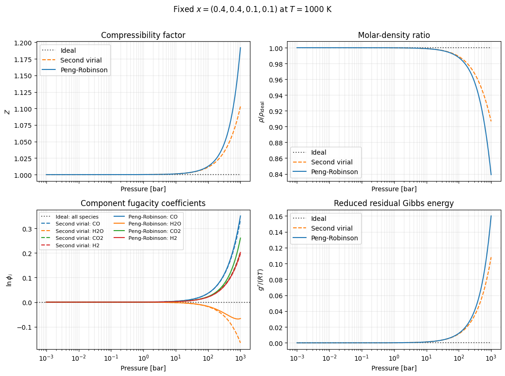
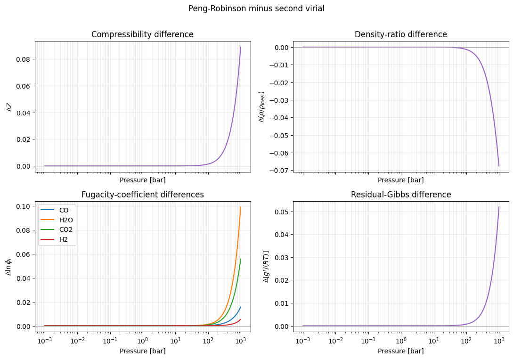

.. This file is generated from the sibling .ipynb by convert_notebooks.py.
.. Do not edit this RST file directly.

:download:`Download the executable notebook <fixed_composition_cho_eos_comparison.ipynb>`

A1. Fixed-composition C–H–O mixture: comparison of three EOS
============================================================

This demonstration compares the ideal, second-virial, and Peng–Robinson
(PR) equations of state for the frozen gas composition

.. math::

   (x_{\mathrm{CO}},x_{\mathrm{H_2O}},x_{\mathrm{CO_2}},x_{\mathrm{H_2}})
   =(0.4,0.4,0.1,0.1).

The temperature is fixed at :math:`T=1000` K and pressure spans
:math:`10^{-3}`–:math:`10^3` bar. The composition is deliberately held
fixed: no water-gas-shift reaction or phase-equilibrium calculation is
performed. All ExoEOS inputs use SI units, so pressure is converted from
bar to Pa before evaluation.

Model definition
----------------

The PR model uses critical properties bundled with ExoEOS. Their source
records are the CoolProp fluid-information pages for
`CO <https://coolprop.org/fluid_properties/fluids/CarbonMonoxide.html>`__,
`H2O <https://coolprop.org/fluid_properties/fluids/Water.html>`__,
`CO2 <https://coolprop.org/fluid_properties/fluids/CarbonDioxide.html>`__,
and `H2 <https://coolprop.org/fluid_properties/fluids/Hydrogen.html>`__.
Binary interaction parameters are set to :math:`k_{ij}=0` as a
pedagogical simplifying assumption.

For a controlled comparison, the second-virial matrix is the exact
low-density expansion of the same PR model at 1000 K,

.. math::

   B_{ij}(T)=\frac{b_i+b_j}{2}-\frac{a_{ij}(T)}{RT},
   \qquad
   a_{ij}=(1-k_{ij})\sqrt{a_i a_j}.

Thus the second-virial result is a PR-consistent truncation, not an
independent experimental virial correlation. Matching the first density
correction isolates the effect of terms beyond second virial.

.. code:: ipython3

    import os

    os.environ.setdefault("JAX_PLATFORMS", "cpu")
    os.environ.setdefault("JAX_PLATFORM_NAME", "cpu")
    os.environ.setdefault("MPLCONFIGDIR", "/tmp/exoeos_matplotlib")

    from jax import config

    config.update("jax_enable_x64", True)

    import jax
    import jax.numpy as jnp
    import matplotlib.pyplot as plt
    import numpy as np

    from exoeos import (
        IdealEOS,
        PengRobinsonEOS,
        SecondVirialEOS,
        get_critical_properties,
        state_tp,
    )
    from exoeos.constants import MOLAR_GAS_CONSTANT

    species = ("CO", "H2O", "CO2", "H2")
    composition = jnp.asarray([0.4, 0.4, 0.1, 0.1])
    temperature = 1000.0  # K
    pressure_bar = jnp.logspace(-3.0, 3.0, 301)
    pressure = pressure_bar * 1.0e5  # Pa

    records = tuple(get_critical_properties(name) for name in species)
    critical_temperatures = jnp.asarray(
        [record.critical_temperature for record in records]
    )
    critical_pressures = jnp.asarray(
        [record.critical_pressure for record in records]
    )
    acentric_factors = jnp.asarray([record.acentric_factor for record in records])

    pr_eos = PengRobinsonEOS(
        critical_temperatures,
        critical_pressures,
        acentric_factors,
    )
    virial_coefficients = pr_eos.second_virial_coefficients(temperature)
    eos_models = {
        "Ideal": IdealEOS(),
        "Second virial": SecondVirialEOS(virial_coefficients),
        "Peng-Robinson": pr_eos,
    }

    print(f"{'species':>7} {'x':>7} {'Tc [K]':>12} {'Pc [bar]':>12} {'omega':>12}")
    for name, fraction, record in zip(species, composition, records):
        print(
            f"{name:>7} {float(fraction):7.3f} "
            f"{record.critical_temperature:12.6f} "
            f"{record.critical_pressure / 1.0e5:12.6f} "
            f"{record.acentric_factor:12.6f}"
        )

    mixture_virial = composition @ virial_coefficients @ composition
    print(f"\nB_mix(1000 K) = {float(mixture_virial) * 1.0e6:.6f} cm^3 mol^-1")

.. parsed-literal::

    species       x       Tc [K]     Pc [bar]        omega
         CO   0.400   132.859895    34.981947     0.049700
        H2O   0.400   647.096000   220.640000     0.344292
        CO2   0.100   304.128200    73.772984     0.223940
         H2   0.100    33.144333    12.963576    -0.219000

    B_mix(1000 K) = 9.448576 cm^3 mol^-1

Evaluation and numerical checks
-------------------------------

``state_tp`` accepts one scalar state at a time, so ``jax.vmap``
evaluates the pressure grid. For every EOS we verify

.. math::

   Z=\frac{P}{\rho RT},
   \qquad
   \frac{\rho}{\rho_{\mathrm{ideal}}}=\frac{1}{Z},
   \qquad
   \frac{g^r}{RT}=\sum_i x_i\ln\phi_i.

The ideal state must also give :math:`Z=1`, :math:`\ln\phi_i=0`, and
:math:`g^r/RT=0`.

.. code:: ipython3

    def evaluate_pressure_grid(eos):
        return jax.vmap(
            lambda value: state_tp(eos, temperature, value, composition)
        )(pressure)

    states = {name: evaluate_pressure_grid(eos) for name, eos in eos_models.items()}
    ideal_density = pressure / (MOLAR_GAS_CONSTANT * temperature)
    density_ratios = {
        name: state.rho / ideal_density for name, state in states.items()
    }

    np.testing.assert_allclose(
        np.asarray(virial_coefficients),
        np.asarray(virial_coefficients.T),
        rtol=0.0,
        atol=1.0e-15,
    )
    for name, state in states.items():
        for value in jax.tree_util.tree_leaves(state):
            assert np.all(np.isfinite(np.asarray(value)))
        np.testing.assert_allclose(
            np.asarray(state.P), np.asarray(pressure), rtol=2.0e-12, atol=1.0e-8
        )
        np.testing.assert_allclose(
            np.asarray(density_ratios[name]),
            np.asarray(1.0 / state.Z),
            rtol=2.0e-12,
            atol=1.0e-14,
        )
        np.testing.assert_allclose(
            np.asarray(state.gres_RT),
            np.asarray(state.lnphi @ composition),
            rtol=2.0e-12,
            atol=1.0e-14,
        )

    ideal_state = states["Ideal"]
    np.testing.assert_allclose(np.asarray(ideal_state.Z), 1.0, rtol=0.0, atol=1.0e-14)
    np.testing.assert_allclose(np.asarray(ideal_state.lnphi), 0.0, rtol=0.0, atol=1.0e-14)
    np.testing.assert_allclose(
        np.asarray(ideal_state.gres_RT), 0.0, rtol=0.0, atol=1.0e-14
    )

    pr_state = states["Peng-Robinson"]
    virial_state = states["Second virial"]
    low_pressure_indices = np.asarray([0, 50, 100])  # 0.001, 0.01, 0.1 bar
    low_pressure_delta_z = np.abs(
        np.asarray(pr_state.Z - virial_state.Z)[low_pressure_indices]
    )
    decade_growth = low_pressure_delta_z[1:] / low_pressure_delta_z[:-1]
    assert np.all((decade_growth > 90.0) & (decade_growth < 110.0))

    print("All thermodynamic identities and finite-value checks passed.")
    for name in ("Second virial", "Peng-Robinson"):
        state = states[name]
        print(
            f"{name:>15} at 0.001 bar: "
            f"Z - 1 = {float(state.Z[0] - 1.0):.3e}, "
            f"max abs(ln(phi_i)) = {float(jnp.max(jnp.abs(state.lnphi[0]))):.3e}"
        )

    print("\nValues at 1000 bar:")
    for name, state in states.items():
        print(
            f"{name:>15}: rho = {float(state.rho[-1]):10.3f} mol m^-3, "
            f"Z = {float(state.Z[-1]):.6f}, "
            f"g^r/RT = {float(state.gres_RT[-1]):.6f}"
        )

.. parsed-literal::

    All thermodynamic identities and finite-value checks passed.
      Second virial at 0.001 bar: Z - 1 = 1.136e-07, max abs(ln(phi_i)) = 3.641e-07
      Peng-Robinson at 0.001 bar: Z - 1 = 1.136e-07, max abs(ln(phi_i)) = 3.641e-07

    Values at 1000 bar:
              Ideal: rho =  12027.236 mol m^-3, Z = 1.000000, g^r/RT = 0.000000
      Second virial: rho =  10903.856 mol m^-3, Z = 1.103026, g^r/RT = 0.107995
      Peng-Robinson: rho =  10091.534 mol m^-3, Z = 1.191814, g^r/RT = 0.159990

EOS observables
---------------

The four panels show the compressibility factor, molar-density ratio,
component fugacity coefficients, and reduced residual Gibbs energy.
Density is a molar density in ExoEOS, but
:math:`\rho/\rho_{\mathrm{ideal}}=1/Z` is also the mass-density ratio
for a fixed composition.

.. code:: ipython3

    model_styles = {
        "Ideal": {"color": "0.35", "linestyle": ":"},
        "Second virial": {"color": "tab:orange", "linestyle": "--"},
        "Peng-Robinson": {"color": "tab:blue", "linestyle": "-"},
    }
    species_colors = dict(zip(species, plt.get_cmap("tab10").colors[:4]))

    fig, axes = plt.subplots(2, 2, figsize=(11.0, 8.0), sharex=True)

    for name, state in states.items():
        axes[0, 0].plot(pressure_bar, state.Z, label=name, **model_styles[name])
        axes[0, 1].plot(
            pressure_bar, density_ratios[name], label=name, **model_styles[name]
        )
        axes[1, 1].plot(
            pressure_bar, state.gres_RT, label=name, **model_styles[name]
        )

    axes[1, 0].axhline(0.0, color="0.35", linestyle=":", label="Ideal: all species")
    for model_name, linestyle in (("Second virial", "--"), ("Peng-Robinson", "-")):
        for index, species_name in enumerate(species):
            axes[1, 0].plot(
                pressure_bar,
                states[model_name].lnphi[:, index],
                color=species_colors[species_name],
                linestyle=linestyle,
                label=f"{model_name}: {species_name}",
            )

    axes[0, 0].set_ylabel(r"$Z$")
    axes[0, 0].set_title("Compressibility factor")
    axes[0, 1].set_ylabel(r"$\rho/\rho_{\mathrm{ideal}}$")
    axes[0, 1].set_title("Molar-density ratio")
    axes[1, 0].set_ylabel(r"$\ln \phi_i$")
    axes[1, 0].set_title("Component fugacity coefficients")
    axes[1, 1].set_ylabel(r"$g^r/(RT)$")
    axes[1, 1].set_title("Reduced residual Gibbs energy")

    for axis in axes.flat:
        axis.set_xscale("log")
        axis.set_xlabel("Pressure [bar]")
        axis.grid(True, which="both", alpha=0.25)
    axes[0, 0].legend()
    axes[0, 1].legend()
    axes[1, 0].legend(fontsize=8, ncols=2)
    axes[1, 1].legend()
    fig.suptitle(
        r"Fixed $x=(0.4,0.4,0.1,0.1)$ at $T=1000$ K", y=1.01
    )
    fig.tight_layout()
    plt.show()

At low pressure, both non-ideal models converge to the ideal identities.
Because their second virial coefficients are matched, their leading
difference is quadratic in pressure; the numerical check above confirms
an approximately 100-fold increase in :math:`|\Delta Z|` per pressure
decade in the dilute limit. At high pressure the omitted higher-order
density terms become visible.

PR minus second-virial differences
----------------------------------

The following panels use signed differences, PR minus second virial.
Absolute relative errors are avoided because both residual quantities
and their differences approach zero in the ideal-gas limit.

.. code:: ipython3

    delta_z = pr_state.Z - virial_state.Z
    delta_density_ratio = (
        density_ratios["Peng-Robinson"] - density_ratios["Second virial"]
    )
    delta_lnphi = pr_state.lnphi - virial_state.lnphi
    delta_gres = pr_state.gres_RT - virial_state.gres_RT

    fig, axes = plt.subplots(2, 2, figsize=(11.0, 7.5), sharex=True)
    axes[0, 0].plot(pressure_bar, delta_z, color="tab:purple")
    axes[0, 1].plot(pressure_bar, delta_density_ratio, color="tab:purple")
    for index, species_name in enumerate(species):
        axes[1, 0].plot(
            pressure_bar,
            delta_lnphi[:, index],
            color=species_colors[species_name],
            label=species_name,
        )
    axes[1, 1].plot(pressure_bar, delta_gres, color="tab:purple")

    axes[0, 0].set_ylabel(r"$\Delta Z$")
    axes[0, 0].set_title("Compressibility difference")
    axes[0, 1].set_ylabel(r"$\Delta(\rho/\rho_{\mathrm{ideal}})$")
    axes[0, 1].set_title("Density-ratio difference")
    axes[1, 0].set_ylabel(r"$\Delta\ln \phi_i$")
    axes[1, 0].set_title("Fugacity-coefficient differences")
    axes[1, 0].legend()
    axes[1, 1].set_ylabel(r"$\Delta[g^r/(RT)]$")
    axes[1, 1].set_title("Residual-Gibbs difference")

    for axis in axes.flat:
        axis.axhline(0.0, color="0.6", linewidth=0.8)
        axis.set_xscale("log")
        axis.set_xlabel("Pressure [bar]")
        axis.grid(True, which="both", alpha=0.25)
    fig.suptitle("Peng-Robinson minus second virial", y=1.01)
    fig.tight_layout()
    plt.show()

Interpretation and limitations
------------------------------

- The ideal EOS gives :math:`Z=1`, :math:`\rho/\rho_{\mathrm{ideal}}=1`,
  :math:`\ln\phi_i=0`, and :math:`g^r/RT=0` over the full grid.
- The second-virial and PR curves approach the ideal result at low
  pressure. Their matched low-density term makes the PR–virial
  difference an explicit measure of higher-order PR contributions.
- The second-virial curve above is extended to 1000 bar only to display
  truncation behavior. A second-virial EOS is a low-density
  approximation and its high-pressure values should not be interpreted
  as quantitatively reliable.
- Classical PR with :math:`k_{ij}=0`, particularly for a
  water-containing mixture, is also a teaching model rather than an
  experimental benchmark. No claim of phase-equilibrium or
  reactive-equilibrium accuracy is made.
- If the temperature is changed, regenerate ``virial_coefficients`` with
  ``pr_eos.second_virial_coefficients(new_temperature)`` before
  repeating the comparison.
