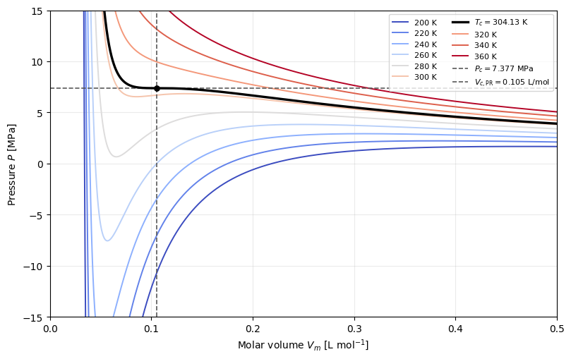

.. This file is generated from the sibling .ipynb by convert_notebooks.py.
.. Do not edit this RST file directly.

:download:`Download the executable notebook <peng_robinson_eos.ipynb>`

Peng–Robinson equation of state: physics, corresponding states, and mixtures
============================================================================

The `Peng–Robinson equation of state (PR
EOS) <https://doi.org/10.1021/i160057a011>`__ is a semi-empirical
**cubic equation of state** introduced in 1976. It gives pressure from
temperature, molar volume, and composition, while retaining a compact
connection to intermolecular repulsion and attraction. For a pure fluid,

.. math::

   P(T,V_m)=\frac{RT}{V_m-b}
   -\frac{a(T)}{V_m(V_m+b)+b(V_m-b)}
   =\frac{RT}{V_m-b}-\frac{a(T)}{V_m^2+2bV_m-b^2}.

The two terms encode a useful physical picture:

- :math:`RT/(V_m-b)` is the repulsive contribution. The covolume
  :math:`b` represents excluded volume, so the pressure diverges as
  :math:`V_m\rightarrow b^+` and the model is evaluated only for
  :math:`V_m>b`.
- The negative term is the cohesive contribution. The effective
  parameter :math:`a(T)` represents attractions, which lower the
  pressure relative to a purely repulsive fluid. At large :math:`V_m` it
  decays approximately as :math:`V_m^{-2}`.

Thus PR approaches :math:`P=RT/V_m` in the dilute limit. The parameters
are effective, macroscopic quantities rather than a literal molecular
diameter and pair potential. The adjective *cubic* refers to the cubic
polynomial in :math:`V_m` (or in :math:`Z=PV_m/(RT)`) obtained at fixed
:math:`T` and :math:`P`; it does not refer to the number of fluid
parameters. One real root occurs in much of the one-phase region, while
three real roots can occur below the critical temperature.

ExoEOS implements the same model through the reduced residual molar
Helmholtz energy. With :math:`\rho=1/V_m`, :math:`\delta=b\rho`, and
:math:`\alpha^r=A^r/(nRT)`,

.. math::

   \alpha^r=-\ln(1-\delta)
   -\frac{a(T)}{2\sqrt{2}bRT}
   \ln\!\left[
   \frac{1+(1+\sqrt{2})\delta}{1+(1-\sqrt{2})\delta}
   \right],
   \qquad
   P=\rho RT\left[1+\rho
   \left(\frac{\partial\alpha^r}{\partial\rho}\right)_T\right].

This free-energy form makes pressure, chemical potentials, and fugacity
coefficients thermodynamically consistent and accessible by automatic
differentiation.

A three-parameter corresponding-states model
--------------------------------------------

In the original PR76 parameterization, the pure-fluid coefficients are

.. math::

   a(T)=\Omega_a\frac{R^2T_c^2}{P_c}\alpha(T),
   \qquad
   b=\Omega_b\frac{RT_c}{P_c},

.. math::

   \alpha(T)=\left[1+\kappa(\omega)
   \left(1-\sqrt{T/T_c}\right)\right]^2,
   \qquad
   \kappa(\omega)=0.37464+1.54226\omega-0.26992\omega^2,

with :math:`\Omega_a=0.45723552892138218938` and
:math:`\Omega_b=0.077796073903888455972`. These are the exact
critical-condition constants given by `Bell and Deiters
(2021) <https://doi.org/10.1021/acs.iecr.1c00847>`__. ExoEOS uses the
original PR76 :math:`\kappa` correlation for every value of
:math:`\omega`.

The three pure-fluid inputs have distinct roles:

+-----------------------------------+-----------------------------------+
| Input                             | Meaning in corresponding states   |
+===================================+===================================+
| Critical temperature :math:`T_c`  | The temperature at the end of     |
|                                   | vapor–liquid coexistence; it sets |
|                                   | the temperature scale.            |
+-----------------------------------+-----------------------------------+
| Critical pressure :math:`P_c`     | The pressure at that endpoint;    |
|                                   | together with :math:`T_c`, it     |
|                                   | sets the molar-volume scale       |
|                                   | :math:`RT_c/P_c`.                 |
+-----------------------------------+-----------------------------------+
| Acentric factor :math:`\omega`    | An empirical measure of departure |
|                                   | from the reduced vapor-pressure   |
|                                   | curve of a simple, nearly         |
|                                   | spherical fluid; PR uses it to    |
|                                   | shape the temperature dependence  |
|                                   | of attraction.                    |
+-----------------------------------+-----------------------------------+

The `Pitzer acentric factor <https://doi.org/10.1021/ja01618a002>`__ is
defined by

.. math::

   \omega=-\log_{10}\left[
   \left.\frac{P_{\mathrm{sat}}}{P_c}\right|_{T/T_c=0.7}
   \right]-1.

It summarizes effects of molecular shape, complexity, and polarity
through a readily tabulated vapor-pressure property; it is not a direct
microscopic measure of any one of them. For CO₂,
:math:`0.7T_c\simeq212.9` K lies below the triple point, so this
definition is understood through an extrapolated liquid vapor-pressure
curve.

The corresponding-states structure becomes explicit on defining
:math:`T_r=T/T_c`, :math:`P_r=P/P_c`, and
:math:`\widehat V=P_cV_m/(RT_c)`:

.. math::

   P_r=\frac{T_r}{\widehat V-\Omega_b}
   -\frac{\Omega_a\alpha(T_r,\omega)}
   {\widehat V^2+2\Omega_b\widehat V-\Omega_b^2}.

No fluid-specific quantity remains except :math:`\omega`. This is why PR
is a generalized EOS based on three-parameter corresponding states: the
same reduced equation is reused for different pure fluids. Once
:math:`(T_c,P_c,\omega)` and the PR76 convention are specified, the
pure-fluid PR pressure surface is completely determined. The original
paper calls PR a *two-constant* EOS because its pressure form contains
the two structural coefficients :math:`a` and :math:`b`; the
corresponding-states construction nevertheless uses the three fluid
properties :math:`(T_c,P_c,\omega)`, with :math:`\omega` controlling
:math:`a(T)`.

The critical-point constraints

.. math::

   \left(\frac{\partial P}{\partial V_m}\right)_{T_c}=0,
   \qquad
   \left(\frac{\partial^2 P}{\partial V_m^2}\right)_{T_c}=0

fix :math:`\Omega_a` and :math:`\Omega_b`. They also force the same
critical compressibility for every PR fluid,

.. math::

   Z_{c,\mathrm{PR}}=0.30740130869870385,
   \qquad
   V_{c,\mathrm{PR}}=Z_{c,\mathrm{PR}}\frac{RT_c}{P_c}.

Consequently :math:`V_c` is a PR prediction, not a fourth input, and it
need not equal the measured critical volume.

.. code:: ipython3

    import os

    os.environ.setdefault("JAX_PLATFORMS", "cpu")
    os.environ.setdefault("JAX_PLATFORM_NAME", "cpu")
    os.environ.setdefault("MPLCONFIGDIR", "/tmp/exoeos_matplotlib")

    from jax import config

    config.update("jax_enable_x64", True)

    import jax
    import jax.numpy as jnp
    import matplotlib.pyplot as plt
    import numpy as np

    from exoeos import PengRobinsonEOS, get_critical_properties, state_tp, state_trho
    from exoeos.constants import MOLAR_GAS_CONSTANT

    PR_OMEGA_B = 0.077796073903888455972
    PR_CRITICAL_COMPRESSIBILITY = (1.0 - PR_OMEGA_B) / 3.0
    CO2_REFERENCE_CRITICAL_DENSITY = 10_624.905587175583  # mol m^-3

    co2 = get_critical_properties("CO2")
    co2_eos = PengRobinsonEOS(
        critical_temperatures=jnp.asarray([co2.critical_temperature]),
        critical_pressures=jnp.asarray([co2.critical_pressure]),
        acentric_factors=jnp.asarray([co2.acentric_factor]),
    )
    co2_composition = jnp.asarray([1.0])

    critical_volume_pr_l_mol = (
        PR_CRITICAL_COMPRESSIBILITY
        * MOLAR_GAS_CONSTANT
        * co2.critical_temperature
        / co2.critical_pressure
        * 1.0e3
    )
    critical_volume_reference_l_mol = 1.0e3 / CO2_REFERENCE_CRITICAL_DENSITY
    covolume_l_mol = (
        PR_OMEGA_B
        * MOLAR_GAS_CONSTANT
        * co2.critical_temperature
        / co2.critical_pressure
        * 1.0e3
    )
    critical_pressure_mpa = co2.critical_pressure / 1.0e6

    critical_state = state_trho(
        co2_eos,
        co2.critical_temperature,
        1.0e3 / critical_volume_pr_l_mol,
        co2_composition,
    )
    np.testing.assert_allclose(critical_state.P, co2.critical_pressure, rtol=2.0e-12)
    np.testing.assert_allclose(
        critical_state.Z, PR_CRITICAL_COMPRESSIBILITY, rtol=2.0e-12
    )

    print(f"CO2 Tc                  = {co2.critical_temperature:.6f} K")
    print(f"CO2 Pc                  = {critical_pressure_mpa:.6f} MPa")
    print(f"CO2 omega               = {co2.acentric_factor:.5f}")
    print(f"PR covolume b            = {covolume_l_mol:.6f} L mol^-1")
    print(f"PR critical volume       = {critical_volume_pr_l_mol:.6f} L mol^-1")
    print(
        f"Reference critical volume = {critical_volume_reference_l_mol:.6f} L mol^-1"
    )

.. parsed-literal::

    CO2 Tc                  = 304.128200 K
    CO2 Pc                  = 7.377298 MPa
    CO2 omega               = 0.22394
    PR covolume b            = 0.026666 L mol^-1
    PR critical volume       = 0.105366 L mol^-1
    Reference critical volume = 0.094118 L mol^-1

CO₂ pressure–volume isotherms
-----------------------------

The CO₂ values above come from the `CoolProp fluid-information
page <https://coolprop.org/fluid_properties/fluids/CarbonDioxide.html>`__.
Its reference critical molar density corresponds to :math:`V_c=0.094118`
L mol\ :math:`^{-1}`, whereas the unmodified PR EOS predicts
:math:`V_{c,\mathrm{PR}}=0.105366` L mol\ :math:`^{-1}`. The vertical
dashed line in the following **PR diagram** therefore marks the model
critical volume. This distinction exposes a common limitation of
unmodified cubic equations: matching the input :math:`T_c` and
:math:`P_c` does not guarantee an accurate liquid or critical volume.

We evaluate isotherms from 200 K to 360 K and insert the exact
:math:`T_c` into the grid. PR is singular at :math:`V_m=b`, so values
are evaluated only for :math:`V_m>b` even though the displayed
horizontal axis starts at zero. The limits are fixed to
:math:`0`–:math:`0.5` L mol\ :math:`^{-1}` and :math:`-15`–:math:`15`
MPa to make the critical region and the subcritical loops visible.

.. code:: ipython3

    temperatures = np.sort(
        np.r_[np.arange(200.0, 361.0, 20.0), co2.critical_temperature]
    )
    volume_l_mol = np.linspace(1.001 * covolume_l_mol, 0.5, 1200)
    molar_density = jnp.asarray(1.0e3 / volume_l_mol)

    def pressure_isotherm(temperature):
        return jax.vmap(
            lambda density: state_trho(
                co2_eos, temperature, density, co2_composition
            ).P
        )(molar_density) / 1.0e6

    pressure_mpa = np.asarray(
        jax.vmap(pressure_isotherm)(jnp.asarray(temperatures))
    )

    fig, ax = plt.subplots(figsize=(8.2, 5.2))
    for temperature, pressure in zip(temperatures, pressure_mpa):
        is_critical = np.isclose(temperature, co2.critical_temperature)
        label = (
            rf"$T_c={temperature:.2f}$ K"
            if is_critical
            else f"{temperature:.0f} K"
        )
        color = (
            "black"
            if is_critical
            else plt.colormaps["coolwarm"]((temperature - 200.0) / 160.0)
        )
        ax.plot(
            volume_l_mol,
            pressure,
            color=color,
            linewidth=2.4 if is_critical else 1.4,
            label=label,
            zorder=3 if is_critical else 2,
        )

    ax.axhline(
        critical_pressure_mpa,
        color="0.35",
        linestyle="--",
        linewidth=1.2,
        label=rf"$P_c={critical_pressure_mpa:.3f}$ MPa",
    )
    ax.axvline(
        critical_volume_pr_l_mol,
        color="0.35",
        linestyle="--",
        linewidth=1.2,
        label=rf"$V_{{c,\mathrm{{PR}}}}={critical_volume_pr_l_mol:.3f}$ L/mol",
    )
    ax.scatter(
        critical_volume_pr_l_mol,
        critical_pressure_mpa,
        color="black",
        s=28,
        zorder=4,
    )
    ax.set(
        xlim=(0.0, 0.5),
        ylim=(-15.0, 15.0),
        xlabel=r"Molar volume $V_m$ [L mol$^{-1}$]",
        ylabel=r"Pressure $P$ [MPa]",
    )
    ax.grid(alpha=0.25)
    ax.legend(ncol=2, fontsize=8, loc="upper right")
    fig.tight_layout()
    plt.show()

How to read the diagram
~~~~~~~~~~~~~~~~~~~~~~~

- At large :math:`V_m`, every curve approaches the ideal-gas behavior
  :math:`P\simeq RT/V_m`.
- Compression toward :math:`b=0.026666` L mol\ :math:`^{-1}` produces
  the steep repulsive wall.
- At :math:`T=T_c`, the black isotherm has a stationary inflection at
  :math:`(V_{c,\mathrm{PR}},P_c)`. Above :math:`T_c` the isotherms are
  monotonic in the displayed region.
- The loops and negative pressures below :math:`T_c` are the
  mathematical continuation of a homogeneous cubic EOS, not the stable
  equilibrium path. Pure-fluid vapor–liquid coexistence instead requires
  equal pressure and chemical potential (or fugacity) in the two phases;
  a Maxwell equal-area construction is an equivalent graphical
  condition.

The 200 K curve is also below the CO₂ triple-point temperature of
216.592 K. It is included to show the requested temperature range, but
it is an extrapolation of the fluid EOS; stable real CO₂ includes a
solid phase there.

Mixtures: a classical one-fluid construction
--------------------------------------------

For component :math:`i`, PR first constructs :math:`a_i(T)` and
:math:`b_i` from :math:`(T_{c,i},P_{c,i},\omega_i)` using the pure-fluid
equations above. ExoEOS then applies the classical quadratic-attraction
and linear-covolume mixing rules

.. math::

   a_{ij}(T)=(1-k_{ij})\sqrt{a_i(T)a_j(T)},

.. math::

   a_{\mathrm{mix}}(T,\boldsymbol{x})
   =\sum_i\sum_j x_i x_j a_{ij}(T),
   \qquad
   b_{\mathrm{mix}}(\boldsymbol{x})=\sum_i x_i b_i.

Substituting :math:`a_{\mathrm{mix}}` and :math:`b_{\mathrm{mix}}` into
the same PR pressure equation treats the mixture as one
composition-dependent effective fluid. The geometric mean estimates
unlike-pair attraction; the dimensionless binary interaction parameter
:math:`k_{ij}` corrects that estimate. Conventionally :math:`k_{ii}=0`
and :math:`k_{ij}=k_{ji}`. ExoEOS uses a zero matrix when it is omitted.

A mixture therefore requires the mole fractions :math:`\boldsymbol{x}`
in addition to each component’s :math:`(T_c,P_c,\omega)`, and predictive
work may also require :math:`k_{ij}` values fitted to appropriate
mixture data. Setting every :math:`k_{ij}=0` is an explicit modeling
assumption, not a universal law.

.. code:: ipython3

    species = ("CO2", "H2")
    records = tuple(get_critical_properties(name) for name in species)
    binary_interactions = jnp.zeros((2, 2))  # illustrative, not fitted
    mixture_eos = PengRobinsonEOS(
        critical_temperatures=jnp.asarray(
            [record.critical_temperature for record in records]
        ),
        critical_pressures=jnp.asarray(
            [record.critical_pressure for record in records]
        ),
        acentric_factors=jnp.asarray(
            [record.acentric_factor for record in records]
        ),
        binary_interaction_parameters=binary_interactions,
    )
    mixture_composition = jnp.asarray([0.9, 0.1])
    mixture_state = state_tp(
        mixture_eos,
        T=350.0,
        P=5.0e6,
        x=mixture_composition,
        phase="vapor",
    )

    print(f"Z = {float(mixture_state.Z):.6f}")
    print(f"rho = {float(mixture_state.rho):.6f} mol m^-3")
    print("ln(phi_i) =", np.asarray(mixture_state.lnphi))

.. parsed-literal::

    Z = 0.863682
    rho = 1989.363143 mol m^-3
    ln(phi_i) = [-0.16593746  0.12789471]

Scope and practical cautions
----------------------------

PR is popular because a small set of tabulated properties yields a
pressure-explicit, computationally inexpensive, and thermodynamically
complete residual model. That compactness also defines its limitations:

- :math:`(T_c,P_c,\omega)` determine the pure-fluid PVT and
  residual/departure behavior, but absolute enthalpy, entropy, and heat
  capacity still require an ideal-gas reference contribution.
- A requested ``phase="vapor"`` or ``phase="liquid"`` selects a cubic
  root; it does not by itself prove global phase stability or perform a
  saturation/flash calculation. A two-phase mixture generally has
  different liquid and vapor compositions, found by enforcing equality
  of every component fugacity.
- Unmodified PR can be inaccurate for liquid densities and for strongly
  polar, hydrogen-bonding, or associating fluids. Volume translations,
  improved alpha functions, calibrated binary interactions, or more
  detailed EOS families are used when those effects matter.

For equation details, see the `original PR76
paper <https://doi.org/10.1021/i160057a011>`__ and the `NIST PR
summary <https://trc.nist.gov/TDE/TDE_Help/DETAILS-TDE-Peng-Robinson-EOS.htm>`__.
