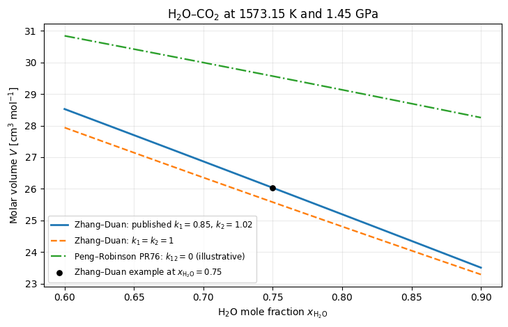

.. This file is generated from the sibling .ipynb by convert_notebooks.py.
.. Do not edit this RST file directly.

:download:`Download the executable notebook <zhang_duan_eos.ipynb>`

Zhang–Duan equation of state: reduced variables, parameters, and a mantle-fluid example
=======================================================================================

The `Zhang–Duan (2009) equation of
state <https://doi.org/10.1016/j.gca.2009.01.021>`__ is a
corresponding-states correlation for dense C–O–H molecular fluids.
Unlike the Peng–Robinson cubic EOS, it is intended primarily for the
high-temperature, high-pressure conditions of Earth’s mantle. It
correlates the physical compressibility factor

.. math::

   Z=\frac{PV}{RT}=\frac{P}{\rho RT},

where :math:`V=1/\rho` is physical molar volume. Define an energy scale
:math:`\theta=\epsilon_{\mathrm{mix}}/k_B`, a size scale
:math:`\sigma=\sigma_{\mathrm{mix}}`, and the reduced variables

.. math::

   T_m=\frac{154T}{\theta},
   \qquad
   \delta=\frac{\rho}{1000\ \mathrm{mol\,m^{-3}}}
   \left(\frac{\sigma}{3.691\times10^{-10}\ \mathrm{m}}\right)^3.

With four temperature-dependent coefficients

.. math::

   \begin{aligned}
   B(T_m)&=a_1+\frac{a_2}{T_m^2}+\frac{a_3}{T_m^3}, &
   C(T_m)&=a_4+\frac{a_5}{T_m^2}+\frac{a_6}{T_m^3},\\
   D(T_m)&=a_7+\frac{a_8}{T_m^2}+\frac{a_9}{T_m^3}, &
   E(T_m)&=a_{10}+\frac{a_{11}}{T_m^2}+\frac{a_{12}}{T_m^3},
   \end{aligned}

the EOS used by ExoEOS is

.. math::

   \boxed{
   Z=1+B\delta+C\delta^2+D\delta^4+E\delta^5
   +\frac{a_{13}}{T_m^3}\delta^2
   \left(a_{14}+a_{15}\delta^2\right)
   e^{-a_{15}\delta^2}
   },
   \qquad P=\rho RTZ.

Thus :math:`Z\rightarrow1` as :math:`\rho\rightarrow0`. The polynomial
and damped-exponential terms form one empirical correlation; they do not
separate into the simple repulsive and attractive terms of a cubic EOS.

ExoEOS integrates this equation into a reduced residual molar Helmholtz
energy. Setting :math:`q=a_{15}\delta^2`,

.. math::

   \alpha^r=\frac{A^r}{nRT}
   =B\delta+\frac{C}{2}\delta^2+\frac{D}{4}\delta^4
   +\frac{E}{5}\delta^5
   +\frac{a_{13}}{2a_{15}T_m^3}
   \left[(a_{14}+1)(1-e^{-q})-qe^{-q}\right].

It then obtains pressure and residual chemical potentials consistently
by differentiation,

.. math::

   P=\rho RT\left[1+\rho
   \left(\frac{\partial\alpha^r}{\partial\rho}\right)_{T,\boldsymbol{x}}\right],
   \qquad
   \ln\phi_i=\frac{\mu_i^r}{RT}-\ln Z.

The right-hand side of the paper’s Equation 8 is used with the physical
:math:`Z=PV/(RT)`. ExoEOS does not apply the additional scaling printed
on that equation’s left-hand side because doing so does not reproduce
the paper’s Table 6 volumes. Fugacities are differentiated from
:math:`\alpha^r` rather than transcribed from the paper’s mixture
fugacity expression.

Required parameters
-------------------

A pure Zhang–Duan fluid needs **two species-specific parameters**, not
the three Peng–Robinson properties :math:`(T_c,P_c,\omega)`:

+---------------------------------+---------------------------+--------------------+
| Input                           | Unit                      | Role               |
+=================================+===========================+====================+
| :math:`\theta_i=\epsilon_i/k_B` | K                         | Effective          |
|                                 |                           | Lennard–Jones      |
|                                 |                           | energy scale; it   |
|                                 |                           | sets :math:`T_m`.  |
+---------------------------------+---------------------------+--------------------+
| :math:`\sigma_i`                | m in the API              | Effective          |
|                                 |                           | molecular          |
|                                 |                           | diameter; it sets  |
|                                 |                           | the density scale  |
|                                 |                           | :math:`\delta`.    |
+---------------------------------+---------------------------+--------------------+

These are fitted corresponding-states parameters, not measured critical
properties or literal molecular dimensions.
``ZhangDuanEOS.from_species`` loads the published values:

======= ========================== ====================
Species :math:`\epsilon_i/k_B` [K] :math:`\sigma_i` [Å]
======= ========================== ====================
CH₄     154.0                      3.691
H₂O     510.0                      2.88
CO₂     235.0                      3.79
H₂      31.2                       2.93
CO      105.6                      3.66
O₂      124.5                      3.36
C₂H₆    246.1                      4.35
======= ========================== ====================

For a mixture, normalized mole fractions :math:`x_i` and two symmetric,
dimensionless interaction matrices are also needed. The
Lorentz–Berthelot-type rules are

.. math::

   \theta=\sum_i\sum_j x_i x_j k_{1,ij}
   \sqrt{\theta_i\theta_j},
   \qquad
   \sigma=\sum_i\sum_j x_i x_j k_{2,ij}
   \frac{\sigma_i+\sigma_j}{2}.

Here :math:`k_{1,ij}` scales unlike-pair energy and :math:`k_{2,ij}`
scales unlike-pair size. The neutral value is **one**, unlike the
zero-valued :math:`k_{ij}` convention commonly used by Peng–Robinson
implementations. The published fitted pairs are

======= ================ ================
Pair    :math:`k_{1,ij}` :math:`k_{2,ij}`
======= ================ ================
H₂O–CO₂ 0.85             1.02
H₂O–CH₄ 0.80             1.00
======= ================ ================

Diagonal entries and all other pairs default to one. For an unfitted
pair, one is an approximation rather than a validated interaction
parameter. In the direct constructor, the four model inputs are
therefore ``epsilon_over_k`` with shape ``(N,)``,
``molecular_diameters`` with shape ``(N,)``, and optional
``energy_interaction_parameters`` and ``size_interaction_parameters``,
each with shape ``(N, N)``. Temperature, pressure or density, and
composition are state inputs rather than stored model parameters.

The 15 universal coefficients below are fixed for every species and
mixture. They are part of the EOS definition, not additional caller
inputs.

+-------------+------------------------------------+----------------+-------------------------------------+----------------+-------------------------------------+
| Coefficient | Value                              | Coefficient    | Value                               | Coefficient    | Value                               |
+=============+====================================+================+=====================================+================+=====================================+
| :math:`a_1` | :math:`2.95177298930\times10^{-2}` | :math:`a_6`    | :math:`7.65938947237\times10^4`     | :math:`a_{11}` | :math:`5.35026383543\times10^{-3}`  |
+-------------+------------------------------------+----------------+-------------------------------------+----------------+-------------------------------------+
| :math:`a_2` | :math:`-6.33756452413\times10^3`   | :math:`a_7`    | :math:`2.58661493537\times10^{-6}`  | :math:`a_{12}` | :math:`-2.71106499510\times10^{-1}` |
+-------------+------------------------------------+----------------+-------------------------------------+----------------+-------------------------------------+
| :math:`a_3` | :math:`-2.75265428882\times10^5`   | :math:`a_8`    | :math:`5.21265321460\times10^{-1}`  | :math:`a_{13}` | :math:`2.50387836486\times10^4`     |
+-------------+------------------------------------+----------------+-------------------------------------+----------------+-------------------------------------+
| :math:`a_4` | :math:`1.29128089283\times10^{-3}` | :math:`a_9`    | :math:`-1.39839523753\times10^2`    | :math:`a_{14}` | :math:`7.32267260410\times10^{-1}`  |
+-------------+------------------------------------+----------------+-------------------------------------+----------------+-------------------------------------+
| :math:`a_5` | :math:`-1.45797416153\times10^2`   | :math:`a_{10}` | :math:`-2.36335007175\times10^{-8}` | :math:`a_{15}` | :math:`1.54833359970\times10^{-2}`  |
+-------------+------------------------------------+----------------+-------------------------------------+----------------+-------------------------------------+

H₂O–CO₂ at mantle conditions
----------------------------

A more representative Zhang–Duan example than a low-temperature critical
isotherm is the H₂O–CO₂ system at :math:`T=1573.15` K and :math:`P=1.45`
GPa. These are the conditions used in Figure 1 of the original paper and
lie inside the fitted H₂O–CO₂ range. The example also exercises both
species parameters and the published binary parameters. We first
evaluate a mixture with :math:`x_{\mathrm{H_2O}}=0.75`.

.. code:: ipython3

    import os

    os.environ.setdefault("JAX_PLATFORMS", "cpu")
    os.environ.setdefault("JAX_PLATFORM_NAME", "cpu")
    os.environ.setdefault("MPLCONFIGDIR", "/tmp/exoeos_matplotlib")

    from jax import config

    config.update("jax_enable_x64", True)

    import jax
    import jax.numpy as jnp
    import matplotlib.pyplot as plt
    import numpy as np

    from exoeos import (
        PengRobinsonEOS,
        ZhangDuanEOS,
        get_critical_properties,
        state_tp,
    )

    species = ("H2O", "CO2")
    eos = ZhangDuanEOS.from_species(species)
    temperature = 1573.15  # K
    pressure = 1.45e9  # Pa
    composition = jnp.asarray([0.75, 0.25])
    state = state_tp(eos, temperature, pressure, composition)
    volume_cm3_mol = 1.0e6 / state.rho

    np.testing.assert_allclose(state.P, pressure, rtol=2.0e-12)
    np.testing.assert_allclose(
        state.gres_RT, composition @ state.lnphi, rtol=2.0e-12
    )

    print("species                 =", species)
    print("epsilon_i/k_B [K]      =", np.asarray(eos.epsilon_over_k))
    print("sigma_i [angstrom]     =", np.asarray(eos.molecular_diameters) / 1.0e-10)
    print("k1                     =\n", np.asarray(eos.energy_interaction_parameters))
    print("k2                     =\n", np.asarray(eos.size_interaction_parameters))
    print(f"rho                    = {float(state.rho):.6f} mol m^-3")
    print(f"V                      = {float(volume_cm3_mol):.6f} cm^3 mol^-1")
    print(f"Z                      = {float(state.Z):.9f}")
    print(f"alpha^r                = {float(state.alphar):.9f}")
    print("ln(phi_i)              =", np.asarray(state.lnphi))
    print(f"g^r/(RT)               = {float(state.gres_RT):.9f}")

.. parsed-literal::

    species                 = ('H2O', 'CO2')
    epsilon_i/k_B [K]      = [510. 235.]
    sigma_i [angstrom]     = [2.88 3.79]
    k1                     =
     [[1.   0.85]
     [0.85 1.  ]]
    k2                     =
     [[1.   1.02]
     [1.02 1.  ]]
    rho                    = 38411.916052 mol m^-3
    V                      = 26.033588 cm^3 mol^-1
    Z                      = 2.886009202
    alpha^r                = 0.826874625
    ln(phi_i)              = [1.05218948 3.45546827]
    g^r/(RT)               = 1.653009178

The following composition sweep follows the
:math:`x_{\mathrm{H_2O}}=0.60`–:math:`0.90` interval shown in the paper.
The solid line uses the fitted H₂O–CO₂ pair. The dashed line sets both
unlike-pair parameters to one while retaining the same pure-species
parameters, making the effect of :math:`k_1` and :math:`k_2` explicit. A
Peng–Robinson PR76 curve is included for reference using the bundled
:math:`(T_c,P_c,\omega)` values and :math:`k_{ij}=0`. It is a
qualitative comparison, not a calibrated PR prediction: no H₂O–CO₂
binary parameter is fitted here, and unmodified PR is not expected to be
quantitatively reliable for a dense, polar, water-rich fluid at 1.45
GPa.

.. code:: ipython3

    water_fractions = jnp.linspace(0.60, 0.90, 121)
    compositions = jnp.column_stack((water_fractions, 1.0 - water_fractions))
    unity_interaction_eos = ZhangDuanEOS(
        eos.epsilon_over_k,
        eos.molecular_diameters,
    )
    critical_properties = tuple(
        get_critical_properties(name) for name in species
    )
    peng_robinson_eos = PengRobinsonEOS(
        critical_temperatures=jnp.asarray(
            [record.critical_temperature for record in critical_properties]
        ),
        critical_pressures=jnp.asarray(
            [record.critical_pressure for record in critical_properties]
        ),
        acentric_factors=jnp.asarray(
            [record.acentric_factor for record in critical_properties]
        ),
        binary_interaction_parameters=jnp.zeros((2, 2)),  # illustrative
    )

    def molar_volume(model, x):
        return 1.0e6 / state_tp(model, temperature, pressure, x).rho

    published_volumes = np.asarray(
        jax.vmap(lambda x: molar_volume(eos, x))(compositions)
    )
    unity_volumes = np.asarray(
        jax.vmap(lambda x: molar_volume(unity_interaction_eos, x))(compositions)
    )
    peng_robinson_volumes = np.asarray(
        jax.vmap(lambda x: molar_volume(peng_robinson_eos, x))(compositions)
    )

    fig, ax = plt.subplots(figsize=(7.4, 4.8))
    ax.plot(
        water_fractions,
        published_volumes,
        linewidth=2.0,
        label=r"Zhang–Duan: published $k_1=0.85$, $k_2=1.02$",
    )
    ax.plot(
        water_fractions,
        unity_volumes,
        linestyle="--",
        linewidth=1.7,
        label=r"Zhang–Duan: $k_1=k_2=1$",
    )
    ax.plot(
        water_fractions,
        peng_robinson_volumes,
        color="tab:green",
        linestyle="-.",
        linewidth=1.7,
        label=r"Peng–Robinson PR76: $k_{12}=0$ (illustrative)",
    )
    ax.scatter(
        [float(composition[0])],
        [float(volume_cm3_mol)],
        color="black",
        s=28,
        zorder=3,
        label=r"Zhang–Duan example at $x_{\mathrm{H_2O}}=0.75$",
    )
    ax.set(
        xlabel=r"H$_2$O mole fraction $x_{\mathrm{H_2O}}$",
        ylabel=r"Molar volume $V$ [cm$^3$ mol$^{-1}$]",
        title=r"H$_2$O–CO$_2$ at 1573.15 K and 1.45 GPa",
    )
    ax.grid(alpha=0.25)
    ax.legend(fontsize=8.5)
    fig.tight_layout()
    plt.show()

The Zhang–Duan volume decreases across this interval as H₂O replaces
CO₂. The separation between its two curves is the contribution of the
fitted unlike-pair parameters; those curves would coincide at either
pure end member. The larger PR76 volume illustrates sensitivity to the
EOS and binary-interaction assumption at this high pressure, but it must
not be read as evidence that either model is more accurate without
comparison to reference data and a defensible PR binary parameter. Every
point is a prescribed, homogeneous composition. This sweep is not a
reaction-equilibrium or phase-equilibrium path.

Scope and practical cautions
----------------------------

The ranges below are the envelopes of experimental and
molecular-dynamics data reported in Tables 5 and 7 of Zhang and Duan
(2009), not guarantees that every state inside each bounding rectangle
has equal accuracy. The two directly calibrated mixtures are

+-------------+------------------+------------------+------------------+
| Mixture     | Temperature [K]  | Pressure [MPa]   | Reported mean    |
|             |                  |                  | volume deviation |
+=============+==================+==================+==================+
| H₂O–CO₂     | 673–2573         | 1–10,000         | 1.12%            |
+-------------+------------------+------------------+------------------+
| H₂O–CH₄     | 673–2573         | 10–10,000        | 1.97%            |
+-------------+------------------+------------------+------------------+

Pure-species data ranges differ substantially:

======= ========================== ==========================
Species Experimental-data range    Molecular-dynamics range
======= ========================== ==========================
CH₄     273–723 K, 0.1–1015.5 MPa  673–2573 K, 50–10,000 MPa
CO₂     473–1100 K, 0.1–800 MPa    673–2573 K, 800–10,000 MPa
H₂O     673–1873 K, 0.1–5000 MPa   673–2573 K, 800–10,000 MPa
H₂      250–423 K, 2–700 MPa       —
CO      300–573.2 K, 10–1020.6 MPa —
O₂      300–1000 K, 7–1013.2 MPa   —
C₂H₆    373–673 K, 30–900 MPa      —
======= ========================== ==========================

Evaluation outside the relevant reported range is extrapolation. In
particular, the broad H₂O–CO₂ or H₂O–CH₄ range should not be assigned
automatically to every pure species or every possible binary pair.

Additional boundaries of the ExoEOS implementation are:

- ``ZhangDuanEOS`` describes one homogeneous molecular fluid. It does
  not perform vapor–liquid separation, global phase-stability analysis,
  or a flash calculation.
- ``state_tp(..., phase="vapor")`` selects the first mechanically stable
  root connected to the low-density branch. ``"vapor"`` is the common
  API selector even when the high-pressure state is a dense fluid; it is
  not proof of vapor stability.
- The class implements the PVT/residual-fugacity EOS portion of the 2009
  work. The paper’s reaction-speciation minimization, standard chemical
  potentials, and solid-carbon phases are separate and are not included.
- Only H₂O–CO₂ and H₂O–CH₄ have fitted binary parameters in
  ``from_species``; all other unlike pairs use the unity approximation.
- Absolute enthalpy, entropy, and heat capacity require ideal-gas
  reference contributions in addition to this residual EOS.

For the correlation, parameter tables, and validation data, see `Zhang
and Duan (2009) <https://doi.org/10.1016/j.gca.2009.01.021>`__.
