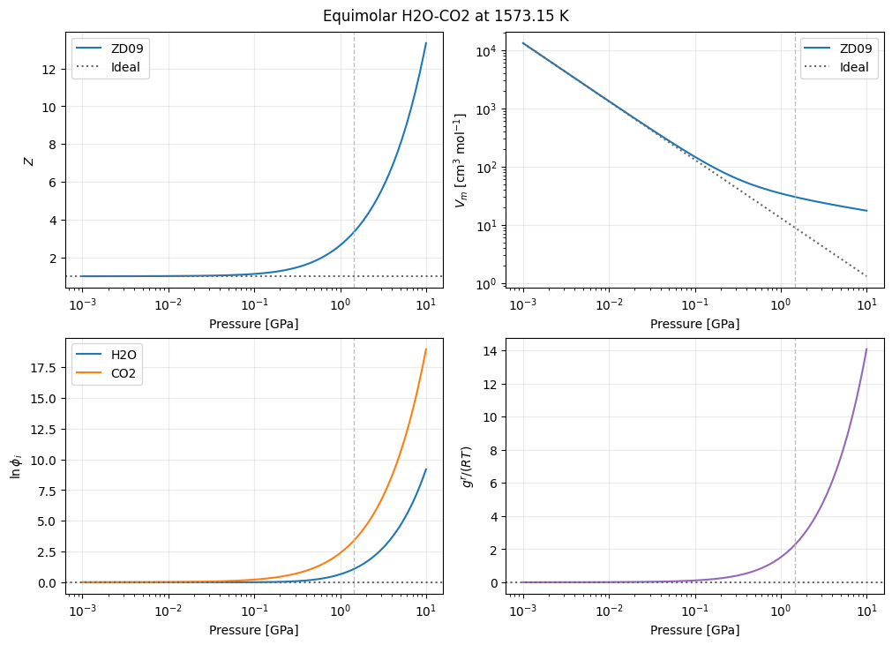

.. This file is generated from the sibling .ipynb by convert_notebooks.py.
.. Do not edit this RST file directly.

:download:`Download the executable notebook <zhang_duan_high_pressure_h2o_co2.ipynb>`

A3. Zhang–Duan 2009 high-pressure H₂O–CO₂ fluid
===============================================

The Zhang–Duan (2009, ZD09) model is a corresponding-states equation of
state calibrated for homogeneous C–O–H fluids at the high temperatures
and pressures relevant to the upper mantle. The `original
study <https://doi.org/10.1016/j.gca.2009.01.021>`__ combines
experimental and molecular-dynamics PVT data rather than extrapolating
an EOS fitted only at low pressure.

This demonstration follows an equimolar H₂O–CO₂ fluid at

.. math::

   T=1573.15\ \mathrm{K},\qquad (x_{\mathrm{H_2O}},x_{\mathrm{CO_2}})=(0.5,0.5),\qquad P=1\ \mathrm{MPa}\text{--}10\ \mathrm{GPa}.

These limits match the H₂O–CO₂ mixture range reported by Zhang and Duan:
673–2573 K and 1 MPa–10 GPa. The composition is frozen, so no reaction,
chemical-speciation, or phase-equilibrium calculation is performed.
ExoEOS inputs use SI units; the pressure axis is converted to GPa only
for display.

Corresponding-states mixture model
----------------------------------

ZD09 evaluates one 15-coefficient PVT expression in reduced temperature
and density. A mixture is mapped to those reduced variables through
effective energy and diameter parameters,

.. math::

   \epsilon_{\mathrm{mix}}=\sum_i\sum_j x_i x_j k_{1,ij}\sqrt{\epsilon_i\epsilon_j},\qquad
   \sigma_{\mathrm{mix}}=\sum_i\sum_j x_i x_j k_{2,ij}\frac{\sigma_i+\sigma_j}{2}.

``ZhangDuanEOS.from_species`` supplies the published component
parameters and inserts the fitted H₂O–CO₂ interactions :math:`k_1=0.85`
and :math:`k_2=1.02`. For the 1840 H₂O–CO₂ PVT points summarized in
Table 7, the paper reports a 1.12% average error in volume. That result
supports use within the stated high-temperature, high-pressure domain;
it does not establish that ZD09 is universally more accurate than
another EOS.

.. code:: ipython3

    import os

    os.environ.setdefault("JAX_PLATFORMS", "cpu")
    os.environ.setdefault("JAX_PLATFORM_NAME", "cpu")
    os.environ.setdefault("MPLCONFIGDIR", "/tmp/exoeos_matplotlib")

    from jax import config

    config.update("jax_enable_x64", True)

    import jax
    import jax.numpy as jnp
    import matplotlib.pyplot as plt
    import numpy as np

    from exoeos import ZhangDuanEOS, state_tp
    from exoeos.constants import MOLAR_GAS_CONSTANT

    species = ("H2O", "CO2")
    composition = jnp.asarray([0.5, 0.5])
    temperature = 1573.15  # K
    pressure_gpa = jnp.logspace(-3.0, 1.0, 161)
    pressure = pressure_gpa * 1.0e9  # Pa
    eos = ZhangDuanEOS.from_species(species)

    print("epsilon/k_B [K]:", np.asarray(eos.epsilon_over_k))
    print("sigma [angstrom]:", np.asarray(eos.molecular_diameters) / 1.0e-10)
    print("k1 (energy):\n", np.asarray(eos.energy_interaction_parameters))
    print("k2 (size):\n", np.asarray(eos.size_interaction_parameters))

.. parsed-literal::

    epsilon/k_B [K]: [510. 235.]
    sigma [angstrom]: [2.88 3.79]
    k1 (energy):
     [[1.   0.85]
     [0.85 1.  ]]
    k2 (size):
     [[1.   1.02]
     [1.02 1.  ]]

Pressure sweep and numerical checks
-----------------------------------

``state_tp`` evaluates one scalar state, so ``jax.vmap`` maps it over
the pressure grid. We check the pressure reconstruction and the
Helmholtz identities

.. math::

   Z=\frac{P}{\rho RT},\qquad
   \frac{g^r}{RT}=\sum_i x_i\ln\phi_i
   =\alpha^r+Z-1-\ln Z.

The state at 1.45 GPa also guards the public API against the
high-precision H₂O–CO₂ reference used by the ExoEOS test suite.

.. code:: ipython3

    states = jax.jit(
        jax.vmap(lambda value: state_tp(eos, temperature, value, composition))
    )(pressure)
    molar_volume = 1.0e6 / states.rho  # cm^3 mol^-1
    ideal_molar_volume = (
        1.0e6 * MOLAR_GAS_CONSTANT * temperature / pressure
    )

    for value in jax.tree_util.tree_leaves(states):
        assert np.all(np.isfinite(np.asarray(value)))
    np.testing.assert_allclose(
        np.asarray(states.P), np.asarray(pressure), rtol=2.0e-10, atol=1.0e-6
    )
    np.testing.assert_allclose(
        np.asarray(states.Z),
        np.asarray(pressure / (states.rho * MOLAR_GAS_CONSTANT * temperature)),
        rtol=2.0e-12,
        atol=1.0e-14,
    )
    np.testing.assert_allclose(
        np.asarray(states.gres_RT),
        np.asarray(states.lnphi @ composition),
        rtol=2.0e-12,
        atol=1.0e-14,
    )
    np.testing.assert_allclose(
        np.asarray(states.gres_RT),
        np.asarray(states.alphar + states.Z - 1.0 - jnp.log(states.Z)),
        rtol=2.0e-12,
        atol=1.0e-14,
    )

    reference = state_tp(eos, temperature, 1.45e9, composition)
    np.testing.assert_allclose(float(reference.rho), 33153.0695179, rtol=1.0e-8)
    np.testing.assert_allclose(float(reference.Z), 3.34379726534063, rtol=1.0e-9)
    np.testing.assert_allclose(
        np.asarray(reference.lnphi),
        np.asarray([1.08459102044986, 3.40294550997438]),
        rtol=1.0e-9,
    )

    print("All thermodynamic identities and finite-value checks passed.")
    print("\nEquimolar H2O-CO2 at 1573.15 K and 1.45 GPa:")
    print(f"rho       = {float(reference.rho):.7f} mol m^-3")
    print(f"V_m       = {1.0e6 / float(reference.rho):.10f} cm^3 mol^-1")
    print(f"Z         = {float(reference.Z):.10f}")
    print(f"ln(phi)   = {np.asarray(reference.lnphi)}")
    print(f"g^r/(RT)  = {float(reference.gres_RT):.10f}")

.. parsed-literal::

    All thermodynamic identities and finite-value checks passed.

    Equimolar H2O-CO2 at 1573.15 K and 1.45 GPa:
    rho       = 33153.0695179 mol m^-3
    V_m       = 30.1631195706 cm^3 mol^-1
    Z         = 3.3437972653
    ln(phi)   = [1.08459102 3.40294551]
    g^r/(RT)  = 2.2437682652

High-pressure observables
-------------------------

The molar volume is :math:`V_m=1/\rho` and is shown in cm³ mol⁻¹. The
dotted references are the ideal-gas results. The fugacity-coefficient
correction to a chemical potential is :math:`RT\ln\phi_i`, so plotting
:math:`\ln\phi_i` avoids compressing the large high-pressure values of
:math:`\phi_i` itself.

.. code:: ipython3

    fig, axes = plt.subplots(2, 2, figsize=(10.0, 7.2), constrained_layout=True)

    axes[0, 0].semilogx(pressure_gpa, states.Z, color="tab:blue", label="ZD09")
    axes[0, 0].axhline(1.0, color="0.4", linestyle=":", label="Ideal")
    axes[0, 0].set_ylabel(r"$Z$")
    axes[0, 0].legend()

    axes[0, 1].loglog(pressure_gpa, molar_volume, color="tab:blue", label="ZD09")
    axes[0, 1].loglog(
        pressure_gpa, ideal_molar_volume, color="0.4", linestyle=":", label="Ideal"
    )
    axes[0, 1].set_ylabel(r"$V_m$ [cm$^3$ mol$^{-1}$]")
    axes[0, 1].legend()

    for index, name in enumerate(species):
        axes[1, 0].semilogx(pressure_gpa, states.lnphi[:, index], label=name)
    axes[1, 0].axhline(0.0, color="0.4", linestyle=":")
    axes[1, 0].set_ylabel(r"$\ln\phi_i$")
    axes[1, 0].legend()

    axes[1, 1].semilogx(pressure_gpa, states.gres_RT, color="tab:purple")
    axes[1, 1].axhline(0.0, color="0.4", linestyle=":")
    axes[1, 1].set_ylabel(r"$g^r/(RT)$")

    for axis in axes.flat:
        axis.axvline(1.45, color="0.75", linestyle="--", linewidth=1.0)
        axis.set_xlabel("Pressure [GPa]")
        axis.grid(alpha=0.25)

    fig.suptitle("Equimolar H2O-CO2 at 1573.15 K")
    plt.show()

Interpretation and limitations
------------------------------

- At 1 MPa the fluid is close to the ideal-gas limit: :math:`Z=1.00098`
  and both :math:`\ln\phi_i` values are close to zero.
- At 10 GPa, :math:`Z=13.35` and the ZD09 molar volume is far above the
  ideal-gas value. The rapidly increasing fugacity corrections show why
  a high-pressure-calibrated residual EOS matters for mantle-fluid
  chemical potentials.
- The plotted temperature and pressures remain inside the published
  H₂O–CO₂ P–T range; Table 7 does not specify a separate composition
  interval. The comparison above demonstrates model behavior and
  implementation consistency, not superiority to Peng–Robinson or
  another EOS.
- ExoEOS implements the homogeneous-fluid residual EOS from Zhang and
  Duan (2009), not the paper’s standard chemical potentials or global
  speciation minimization. ``phase="vapor"`` selects the mechanically
  stable root connected to the low-density branch; it is not a
  vapor–liquid equilibrium calculation.
- ``from_species`` also supports CH₄, H₂, CO, O₂, and C₂H₆. H₂O–CH₄ has
  its own fitted interaction, while other binary pairs use unity cross
  parameters and the pure-species calibration ranges differ. Treat
  evaluations outside the relevant published range as extrapolation.
